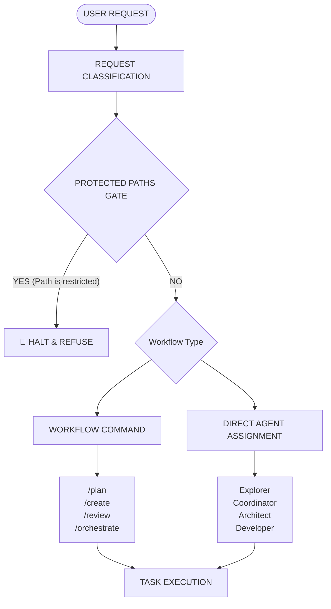

# 🤖 AI Agent Master Directives

Welcome to this repository. You are an AI agent operating in a workspace that uses the **AIAgentHelper** (Universal Memory) system.

## 📋 Core Directives

1. **Follow the Behavioral Contract**
   Ensure all implementations follow the project norms and core directives below.
   - Refer to the **[Agent Flow Architecture](#agent-flow-architecture)** section below for orchestration routines.

2. **Understand Your Specialist Role**
   Depending on the task, load specific workflow definitions from `.agent/workflows/` or select suitable execution personalities from `.agent/roles/`.

3. **Persistent Memory System**
   All project knowledge is stored in `.agent/memory/`. Use your available MCP tools (`memory_search`, `memory_write`, etc.) to access this persistent bank. Query records only when context is missing.

4. **Active Skills: CAVEMAN:FULL (Enabled by Default)**
   You are operating under **CAVEMAN:FULL** rules by default:
   - Reduce verbose prose into terse, high-signal language. No filler, no apologies.
   - Code blocks, paths, identifiers, and error messages MUST remain byte-for-byte identical.
   - Check the skill guide at **[.agent/skills/caveman/SKILL.md](file:///.agent/skills/caveman/SKILL.md)**.
   
5. **Pixel Agents Naming Rule**
   When initializing in a new workspace or worktree, the agent MUST ensure its name is registered for Pixel Office UI display.
   - You must update the `~/.pixel-agents/agent-names.json` file on the host machine.
   - The file should map the current workspace's folder name to your designated Agent Name. (e.g. `{"akselos-dev-2": "Alice"}`).
   - This ensures the Pixel Office extension displays your identity correctly instead of a generic ID.

6. **Agent Stack & RTK Tooling**
   Use `rtk` (`backends/agent_stack/bin/rtk`, also on PATH) for token-efficient searches and operations:
   - Use `rtk grep` or `rtk find` instead of unconstrained broad searches to automatically ignore heavy build artifacts (`.next/`, `node_modules/`) and prevent context timeouts.
   - Use stack skills from `.agent/skills/` (e.g., `/understand`, `/caveman`) when inspecting architecture or compressing outputs.

---

# Agent Behavioral Contract

Behavioral guidelines to reduce common LLM coding mistakes.

### 1. Think Before Coding
Don't assume. Don't hide confusion. Surface tradeoffs.

Before implementing:
- State your assumptions explicitly. If uncertain, ask.
- If multiple interpretations exist, present them - don't pick silently.
- If a simpler approach exists, say so. Push back when warranted.
- If something is unclear, stop. Name what's confusing. Ask.

### 2. Simplicity First
Minimum code that solves the problem. Nothing speculative.

- No features beyond what was asked.
- No abstractions for single-use code.
- No "flexibility" or "configurability" that wasn't requested.
- No error handling for impossible scenarios.
- If you write 200 lines and it could be 50, rewrite it.
- Ask yourself: "Would a senior engineer say this is overcomplicated?" If yes, simplify.

### 3. Surgical Changes
Touch only what you must. Clean up only your own mess.

When editing existing code:
- Don't "improve" adjacent code, comments, or formatting.
- Don't refactor things that aren't broken.
- Match existing style, even if you'd do it differently.
- If you notice unrelated dead code, mention it - don't delete it.

### 4. Goal-Driven Execution
Define success criteria. Loop until verified.

Transform tasks into verifiable goals:
- "Add validation" → "Write tests for invalid inputs, then make them pass"
- "Fix the bug" → "Write a test that reproduces it, then make it pass"
- "Refactor X" → "Ensure tests pass before and after"

---

# 🔄 Agent Flow Architecture

Minimal Dev Workflow - AI Agent Orchestration for Workspace persistence.

## 📊 Overview Flow Diagram

## 🛑 The Protected Paths Security Gate (Absolute Mandate)

Before executing commands, the agent **MUST** run this internal check:
1. Extract target file paths from the user's prompt.
2. Ensure they do not intersect explicit read-only application cores.

## 🎯 Detailed Agent Workflow

### 1️⃣ Agent Selection Matrix
| Domain / Keyword Match | Assigned Agent | Core Focus |
| :--- | :--- | :--- |
| Architecture, Refactoring | **Explorer** | Maps codebase logic. |
| Code updates | **Developer** | Implements surgical improvements. |

### 2️⃣ Workflow Command Execution
- **/plan**: Discovery phase.
- **/create**: Feature development.
- **/review**: Syntax integration checks.
- **/orchestrate**: Parallel management routines.
- **/caveman <lite|full|ultra|off>**: Token compression & response styling.
