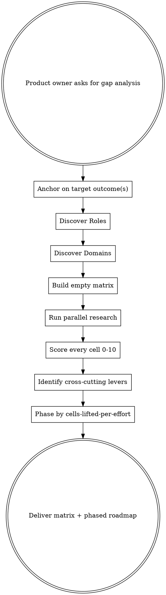

# Coverage Matrix Analysis

Systematic product gap analysis using a Roles × Domains scoring matrix. Anchors on the measurable outcome(s) "best-in-class" must move, discovers who uses the product, what contexts they use it in, scores every combination 0-10, identifies cross-cutting levers, and phases a roadmap by maximum cell-lift per effort.

**Why a matrix, not a flat list**: A flat feature list misses the combinatorial explosion. A "denial management" feature might be great for the billing manager working cardiology claims but useless for the compliance auditor reviewing dermatology. The matrix forces you to evaluate every intersection — that's where the real gaps hide.

## When to Use

- Product owner asks "what's missing?" or "how do we get to best-in-class?"
- Prioritizing a roadmap and need systematic coverage analysis
- Evaluating whether a product truly serves all its user types across all its contexts
- Starting work on a new product vertical or user persona

## When NOT to Use

- Single-feature implementation (just build it)
- Bug triage (use issue tracker)
- Sprint planning for already-prioritized work

## Core Process



---

## Scope: one product at a time (monorepo check)

The matrix scores ONE product — not a repo. A monorepo holds several independent products (a marketing site, an admin dashboard, a CLI, an API), and they do **not** share a persona×domain grid: blending them averages unrelated apps into one meaningless matrix and yields a "cross-cutting lever" computed across products that share no lever.

Detect a multi-product repo: `pnpm-workspace.yaml`, a `package.json` `workspaces` field, `turbo.json`/`lerna.json`/`nx.json`, a Cargo `[workspace]`, `go.work`, or an `apps/*/` + `packages/*/` layout where each app carries its own manifest and user-facing surface.

- **Single product** → proceed to Step 0 as normal.
- **Multiple products** → score ONE: the product the user named, else the primary app (main UI / most activity), and confirm it. Discover roles (Step 1) and domains (Step 2) from THAT product's code, routes, and RBAC — not repo-wide. State the scope above the deliverable ("Matrix scoped to `apps/web`").
- **Asked to cover the whole repo** → produce one matrix PER product (run the steps per product) and present them separately; identify genuine cross-product levers (a shared `packages/*` design system, a shared auth/lifecycle backbone) explicitly — never a single blended grid.

Shared `packages/*` (design system, db, auth) aren't products with personas — they're **levers** that lift multiple products. Handle them in the cross-cutting-lever step (Step 6), not as matrix rows.

---

## Step 0: Anchor on the Target Outcome

Before discovering a single role or scoring a single cell, name **what "best-in-class" is supposed to MOVE**. Per Teresa Torres' Opportunity Solution Tree, all gap analysis hangs off a measurable outcome at the root — otherwise you optimize feature parity in a vacuum and ship a beautifully-covered matrix that moves no metric and can't be defended to a stakeholder asking "what does this change?"

**Do this:**

1. Name **1-3 measurable business/product outcomes** the product exists to move — each a metric with a **current value and a target value**. Examples: "coder throughput: 12 → 20 charts/hr", "claim denial rate: 9% → 4%", "time-to-first-value: 3 days → 1 hour", "weekly active orgs: 40 → 120".
2. Source the numbers where you can (analytics, the product owner, support data). If a value is unknown, mark it `?` and flag it as a research item — don't invent a number.
3. These outcomes become the **root** every later artifact ladders up to: in Step 6 each cross-cutting lever states which outcome it moves, and in Step 7 each roadmap phase states the outcome it advances. A lever or phase that ladders to nothing is a candidate to cut.

**Output**: A short "Target Outcomes" list (metric, current, target) that heads the deliverable above the matrix.

**If the product owner can't name an outcome**, that's the finding — surface it. "We don't know which metric this should move" is a strategy gap, not a reason to skip this step. Offer 2-3 candidate outcomes inferred from the product's purpose and confirm one.

---

## Step 1: Discover Roles

Roles are the **user personas** who interact with the product daily. Not job titles — workflow identities.

**How to discover (do ALL of these):**

1. **Codebase signals**: Grep for RBAC roles, permission sets, nav menu sections, route guards, user types. Each distinct permission set implies a distinct workflow. (In a monorepo, grep **within the scoped product's directory** — e.g. `apps/web/` — not the whole repo, so another app's roles don't bleed in.)
2. **Auth/RBAC inspection**: Read the role definitions, capability sets, and access control lists. Each role cluster = a persona.
3. **UI inspection**: Different dashboard views, different nav items, different landing pages = different roles.
4. **Domain research**: Search the web for "what roles exist in [industry]?" Every B2B product has standard personas the industry expects. Compare what you found in the codebase against industry standard roles.
5. **README/docs**: Product descriptions often mention target users.

**Output**: A numbered list of 5-15 roles with one-line descriptions.

**Common mistake**: Listing org-chart titles instead of workflow roles. "VP of Finance" and "CFO" are the same role if they use the same screens. Merge by workflow, not hierarchy.

---

## Step 2: Discover Domains

Domains are the **verticals, specialties, modules, or contexts** the product must serve. What varies across the product's problem space?

**How to discover:**

1. **Codebase signals**: Look for specialty configs, vertical-specific logic, category enums, module registries, feature flags per context.
2. **Data model inspection**: Taxonomy tables, category fields, type enums — these encode the domains the product already knows about.
3. **Industry research**: Search for "[product category] specialties/verticals/segments". Every market has standard segments.
4. **Competitor analysis**: What segments do competitors serve? Their marketing pages list verticals explicitly. Include the **substitute tier** — the manual/spreadsheet/status-quo process the product replaces often defines the domains better than any vendor does (see the 4-tier classification in Step 4).
5. **Config/admin pages**: Admin settings often expose domain-specific configuration.

**Output**: A numbered list of 5-15 domains with one-line descriptions.

**Not every product has obvious domains.** If the product is domain-agnostic (e.g., a project management tool), use **workflow stages** or **use case categories** as your column axis instead. The matrix still works — the columns just represent different things.

---

## Step 3: Build the Empty Matrix

Create a table: roles as rows, domains as columns. Every cell will get a 0-10 score.

```
|              | Domain A | Domain B | Domain C | ... | Avg |
|--------------|:--------:|:--------:|:--------:|:---:|:---:|
| Role 1       |          |          |          |     |     |
| Role 2       |          |          |          |     |     |
| ...          |          |          |          |     |     |
| **Avg**      |          |          |          |     |     |
```

Include row averages (role strength) and column averages (domain strength). These immediately reveal the weakest roles and domains.

---

## Step 4: Parallel Research

This is where the depth comes from. Dispatch **parallel research streams** — each one focused on a different angle. Use subagents when available.

### Required streams:

| Stream | What it researches | Output |
|--------|-------------------|--------|
| **Codebase inventory** | What exists today — routes, services, models, tests, UI pages | Feature inventory with status |
| **Per-role persona research** (one per role, or batched) | What does "10/10" look like for this role? What does their daily workflow need? | Per-role gap list |
| **Per-domain requirements** (one per domain, or batched) | What domain-specific rules, validations, workflows exist in this vertical? | Per-domain feature requirements |
| **Competitor analysis** | What do the top 5-10 competitors offer, classified into 4 tiers (direct / indirect / adjacent / **substitute** — see below)? Where are they strong/weak? | Tiered competitive feature matrix |
| **Experience walkthrough** (at minimum: the highest-frequency persona × their highest-volume workflow) | How the product is actually EXPERIENCED, not what it contains — see "The Experience Walkthrough Stream" below | Walkthrough narrative + journey scores + ranked friction list |

### The Experience Walkthrough Stream (required — most-skipped, highest-yield)

Every other stream collects *feature existence* evidence. This stream collects *experience* evidence — and without it you will systematically over-score (a real audit found the same product scoring 9/10 on capability and 3.7/10 on experienced workflow; both numbers were true).

Method: trace the persona's actual end-to-end job through UI code or a live session (screens visited, buttons clicked, page-leaves where the next step is non-obvious), then role-play their real day/week against that map. Collect, with evidence:

1. **Click-cost of the core loop** — does N-item work cost O(N) manual clicks (the user IS the workflow engine), or is there bulk?
2. **Lifecycle visibility** — can the user see where their work is in the pipeline (per item AND per batch/run/period), or do they keep a spreadsheet because the product won't remember?
3. **Metric honesty** — do dashboards/metrics read data something actually writes? (Counters with zero writers report fake numbers forever.)
4. **Trust surfaces** — do success messages reflect actual results (partial failures surfaced, not swallowed)? Do buttons route where their labels say? Are items ever stranded between worklists (in no queue's filter)?
5. **Repeated-context cost** — for multi-org/multi-entity/multi-project users: which steps repeat per context that could be aggregated? Does anything PUSH work to the user, or is everything poll?

Score the walked journey on the user's terms (e.g., simple / easy / intuitive / smooth / saves-time, 0-10 each) and rank the friction worst-first with a concrete fix sketch per item.

### Optional streams (if time allows):

- Industry standards research (regulatory requirements, certifications)
- User feedback analysis (support tickets, feature requests, NPS data)
- Market sizing per domain (which domains are highest revenue?)

**Key principle**: Each stream runs independently and produces its own document. Synthesis happens AFTER all streams complete. This prevents premature convergence.

**Parallelism**: When subagents are available, dispatch one agent per research stream simultaneously. This is the single biggest time savings - 4 streams in parallel takes 1x time, sequentially takes 4x. Even without subagents, keep streams separate and don't let early findings from one stream bias another. **Tiered dispatch:** research streams are volume work - on a Fable-class session (any session model above Opus), spawn each stream agent with explicit `model: "opus"` and keep one agent per stream (independent streams stay unbiased by construction, and the parent loop keeps the Fable-grade work: synthesis and scoring after all streams return). On Opus and below, spawn with the session's model (never below Opus).

**Competitor research is mandatory, not optional.** You cannot score "best-in-class" without knowing what class you're in. At minimum, search for the top 5 competitors and what they offer per domain. Marketing pages, G2/Capterra reviews, and analyst reports (KLAS, Gartner, Forrester) are fast sources.

**Classify every competitor into one of 4 tiers** (don't ship a flat "top 5-10" list):

| Tier | Definition | Example |
|------|-----------|---------|
| **Direct** | Same solution, same audience — head-to-head | Another autonomous coding-assist vendor |
| **Indirect** | Different solution, same job-to-be-done | A services/BPO firm that does the coding for you |
| **Adjacent** | Overlapping audience, partial feature overlap | An EHR module that bolts on light coding |
| **Substitute** | The manual / spreadsheet / status-quo the product replaces | A human coder with a reference book and Excel |

The **substitute tier is the most-missed and usually the real bar to beat** — the status-quo process is what every prospect actually compares you against. Always include it and **call substitutes out by name** ("today they do this in a shared Google Sheet + email"). When you set a cell's "best-in-class" (10/10) ceiling per domain, score it against the **strongest tier present in that domain**, not just the easiest competitor — and note which tier set the bar.

**Source tracking is mandatory.** Every competitor claim needs a URL. During research, collect the source URL for every factual claim — product capabilities, market stats, KLAS scores, automation rates, pricing tiers. These will be cited in the final deliverable. Instruct research subagents to include source URLs in their output. No URL = no claim in the final report.

---

## Step 5: Score Every Cell

Use this universal rubric:

| Score | Meaning |
|-------|---------|
| 0 | Not functional at all |
| 1-2 | Barely functional — major features missing, daily work impossible |
| 3-4 | Basic functionality exists but significant workflow gaps |
| 5-6 | Functional core with notable gaps — works but misses efficiency |
| 7-8 | Good coverage with minor gaps — competitive with mid-market |
| 9 | Excellent — near-complete, competitive with best-in-class |
| 10 | Best-in-class — nothing significant missing, industry-leading |

**What 10/10 means**: The user (role) can complete their entire daily workflow for this domain without leaving the product, domain-specific rules are enforced automatically, the system prevents errors before they happen, and analytics surface actionable insights.

**Scoring discipline**:
- Score based on the INTERSECTION, not just the role or domain in isolation
- A feature that exists but isn't useful for a specific role × domain pair scores low for that cell
- Cross-reference your codebase inventory against persona requirements and domain rules
- Be honest — a 4 is a 4. Don't inflate scores because the code technically exists

**Capability ≠ experience — score both axes**:
- A cell may not score **8 or above without walkthrough evidence** for that persona's workflow. Feature-inventory evidence alone caps a cell at 7 — "the rubric says complete daily workflow" is not something you can assess from a feature list.
- For each primary persona, report **two numbers**: the capability score (what the machine can do) and the experience score (what the walkthrough found). Do not average them away — a 9-capability / 4-experience row is the single most actionable finding the matrix can produce, and an average of 6.5 hides it.
- Walkthrough findings translate directly: user-is-the-workflow-engine loops, invisible lifecycle, fake metrics, or lying success states each cap the affected cells at 5-6 regardless of how much machinery exists underneath.

Fill in the matrix. Calculate row and column averages.

---

## Step 6: Identify Cross-Cutting Levers

This is the highest-value analytical step. Look for improvements that lift MANY cells at once.

**How to find them:**

1. **Scan for shared gaps**: If 8 of 10 roles all need "better work queue prioritization", that's a cross-cutting lever
2. **Look at column patterns**: If all non-[strongest domain] columns score 3-4, a "domain engine framework" lifts all of them
3. **Look at row patterns**: If a role scores 2-3 everywhere, that role needs a dedicated workflow suite
4. **Calculate cells-lifted**: For each candidate improvement, count how many matrix cells it would raise and by how much

**Output format:**

| Improvement | Cells Lifted | Avg Score Gain | Confidence | Effort | Outcome |
|------------|:------------:|:--------------:|:----------:|:------:|---------|
| [Name]     | N            | +X.X           | High 1.0 / Med 0.7 / Low 0.4 | S/M/L/XL | which Step 0 outcome it moves |

**Rank by: (cells_lifted × avg_score_gain × confidence) / effort**

**Confidence is an explicit discount on your guess, not a vibe** (this is RICE's whole point — it kills false precision so a wildly-guessed 50-cell lift doesn't outrank a well-evidenced 20-cell lift):

- **High (1.0)** — the `cells_lifted` estimate is backed by walkthrough or competitor evidence (you watched the friction in N cells, or a competitor proves the lift is real).
- **Med (0.7)** — partial evidence; some cells confirmed, others inferred from the pattern.
- **Low (0.4)** — `cells_lifted` is inference/analogy with no direct evidence. A big Low-confidence lever should NOT outrank a smaller High-confidence one — that's the discount working.

**Outcome ladder (required):** every lever names which **Step 0 target outcome** it moves. A lever that ladders to no outcome is a candidate to cut, not ship — surface it rather than ranking it as if feature parity were the goal.

This is the key insight the matrix gives you that a flat list never can — some features are 10x more valuable because they lift dozens of cells simultaneously.

### Optional: score the levers deterministically (recommended at matrix scale)

At 10 roles × 8 domains = 80 cells, ranking a dozen levers by in-context mental arithmetic is error-prone — a miscounted `cells_lifted` or a dropped `× confidence` silently reorders the roadmap. The ecosystem has standardized on a tiny deterministic scorer for exactly this (e.g. alirezarezvani's `rice_prioritizer.py`). Don't eyeball it — write the levers to a small CSV/JSON and let a script sort them. Example you can drop into the scratchpad and run:

```python
# rank_levers.py — feed it a CSV with header: lever,cells_lifted,avg_score_gain,confidence,effort
# effort maps S=1, M=2, L=4, XL=8 (tune as needed). score = (cells*gain*conf)/effort_weight
import csv, sys
EFFORT = {"S": 1, "M": 2, "L": 4, "XL": 8}
rows = []
for r in csv.DictReader(open(sys.argv[1])):
    cells = float(r["cells_lifted"]); gain = float(r["avg_score_gain"])
    conf = float(r["confidence"]); ew = EFFORT[r["effort"].strip().upper()]
    rows.append((round(cells * gain * conf / ew, 2), r["lever"], cells, gain, conf, r["effort"]))
rows.sort(reverse=True)
print(f"{'RANK':<5}{'SCORE':<8}{'LEVER':<32}{'CELLS':<7}{'GAIN':<6}{'CONF':<6}{'EFF'}")
for i, (s, lever, cells, gain, conf, eff) in enumerate(rows, 1):
    print(f"{i:<5}{s:<8}{lever:<32}{cells:<7g}{gain:<6g}{conf:<6g}{eff}")
```

This is optional and stays out of the core flow — but at full-matrix scale the deterministic sort is more trustworthy than the in-context one.

---

## Step 7: Create Phased Roadmap

Order phases by maximum total cell-lift per effort, and **label each phase with a time horizon** — `Now` (in flight / next sprint), `Next` (this quarter), `Later` (beyond) — the format stakeholders expect. The cell-lift-per-effort ranking still drives ordering; the horizon label just makes the sequencing legible.

The four phase archetypes (map them onto Now/Next/Later by ROI):

1. **Foundation phase**: Cross-cutting levers that lift ALL cells (highest ROI)
2. **Role completion phase**: Fill in the weakest rows (roles that can't do their job)
3. **Domain expansion phases**: Add depth to domains, ordered by market impact
4. **Excellence phase**: Polish to 10/10 (diminishing returns — do last)

For each phase, specify:
- **Horizon** — Now / Next / Later (or a quarter label)
- Concrete deliverables (not vague goals)
- Which matrix cells lift and by how much
- **Outcome it advances** — which Step 0 target outcome (and roughly how much) this phase moves. A phase that ladders to no outcome is polish, not priority — say so.
- **Dependencies** — which earlier phase or cross-cutting lever MUST land first. If a top-ranked phase depends on something parked in a later phase, that's a sequencing bug — reorder or split it. Surface the dependency explicitly; don't let a high-ROI phase look startable when it isn't.
- **Capacity sanity-check** — one line: does the effort estimate realistically fit the team/sprint window for this horizon? "3 XL levers in one 2-week sprint with two engineers" is not a plan — flag the overcommit instead of pretending it fits.
- Expected average score after phase completion
- Effort estimate

---

## Step 8: Deliver — Markdown Spec

Save a markdown spec document to the project's `docs/` directory (e.g., `docs/COVERAGE_MATRIX_ANALYSIS.md`) with this structure:

1. **Target outcomes** (the Step 0 anchor — each metric with current → target value)
2. **Scoring methodology** (the rubric)
3. **The matrix** (filled, with row/column averages)
4. **Key observations** (strongest/weakest roles and domains, patterns)
5. **Cross-cutting levers** (ranked by `(cells_lifted × score_gain × confidence) / effort`; each row shows confidence and the outcome it ladders to)
6. **Per-role deep dives** (what exists, what's missing, gap table with priority/effort/score-lift)
7. **Per-domain deep dives** (what the domain needs, architecture sketch)
8. **Competitive position** (competitors classified into direct/indirect/adjacent/substitute tiers; the strongest tier per domain that sets the 10/10 bar)
9. **Workflow experience** (walkthrough narrative, capability-vs-experience scores per primary persona, ranked friction list with fix sketches)
10. **Phased implementation roadmap** (Now/Next/Later horizons; each phase notes dependencies, a capacity sanity-check, and the outcome it advances)
11. **Target matrix** (projected scores after each phase)

This is the working reference document. The HTML report (Step 9) is the presentable version.

---

## Step 9: Generate HTML Report

After the markdown spec is complete, generate a self-contained HTML report alongside it (e.g., `docs/COVERAGE_MATRIX_ANALYSIS.html`). This is the shareable, presentable deliverable — the thing the product owner shows stakeholders.

### Design Requirements

The HTML file must be **fully self-contained** — no external CSS, JS, or fonts. Everything inline in one file. The styling should be polished and professional:

- **Dark theme** — dark background (#0f1117), surface cards (#1a1d27), light text (#e4e6ed)
- **Color-coded heatmap cells** in the matrix — gradient from dark red (0) through yellow (4-5) to teal/blue (7-9), so gaps and strengths are instantly visible at a glance
- **Pipeline diagram** rendered as styled HTML elements (not ASCII art) — show parallel branches if the product workflow has them
- **Score badges** — large, prominent overall and in-market scores at the top
- **Table of contents** with anchor links
- **Responsive** — readable on laptop and tablet screens

### Required Sections in the HTML

1. **Header** with product name, date, metadata cards (market, scope, tech stack), and a prominent **Target Outcomes banner** — the Step 0 metric(s) with current → target values, sitting beside the score badges so the reader sees what the work is supposed to move before the matrix
2. **Pipeline diagram** — visual flow of the product's workflow stages
3. **Scoring methodology** — color-coded rubric table
4. **Roles table** — persona name, route/permission, pipeline stage
5. **Domains table** — domain, current evidence, 10/10 requirements
6. **The heatmap matrix** — the core artifact. Every cell color-coded by score. Row/column averages. Score badges for overall and in-market averages
7. **Key observations** — strengths and critical gaps
8. **Workflow experience** — capability-vs-experience score pair per primary persona, walkthrough excerpt, ranked friction
9. **Competitive position** — tier comparison table that groups competitors into direct / indirect / adjacent / **substitute** (name the status-quo process), and marks which tier sets the 10/10 bar per domain
10. **Cross-cutting levers** — ranked cards with score/effort badges, a **confidence badge** (High/Med/Low), and the **target outcome** each lever ladders to; ranked by `(cells_lifted × score_gain × confidence) / effort`
11. **Phased roadmap** — phase cards with colored left borders, a **Now/Next/Later horizon label**, deliverables, projected scores, plus per-phase **dependencies**, a **capacity sanity-check** line, and the **outcome advanced**
12. **Strategic recommendations** — highlight cards for differentiators and warnings
13. **Competitor profiles** — see below
14. **Progress indicator / feature spec** — if there's a key proposed feature, include the visual mockup
15. **Sources & References** — see below

### Competitor Profiles (with links)

Every competitor mentioned in the analysis gets a profile card in the HTML. Each profile must include:

- Company name and product name
- 2-3 sentence description of what they do
- **Clickable links** to their product page, marketing materials, KLAS ranking, or analyst reports
- Key differentiating features

The point: when someone reads "Dolbey is #1 in KLAS," they can click through and see for themselves. Every competitor claim becomes verifiable.

### Inline Source Citations

Every factual claim about competitors, market data, or industry benchmarks gets a superscript citation number that links to the references section:

```html
Dolbey has been Best in KLAS for CAC for 10 consecutive years<sup><a href="#ref-1">[1]</a></sup>
```

This includes:
- KLAS scores and rankings
- Automation rates (e.g., "Fathom achieves 90%+ automation")
- Market size and growth rates
- Productivity benchmarks (e.g., "50% inpatient productivity increase")
- Any "Company X has Feature Y" claim in the competitor matrix

All external links use `target="_blank" rel="noopener"`.

### Sources & References Section

At the bottom of the HTML, a numbered references list organized by category:

```
## Sources & References

### Dolbey Fusion CAC
[1] KLAS Best in KLAS CAC 2026 — https://klasresearch.com/...
[2] Dolbey Fusion CAC Product Page — https://www.dolbey.com/...

### Market Data & KLAS
[38] Medical Coding Software Market — https://...

### Industry Research
[43] Coding Productivity Benchmarks — https://...
```

Each entry: number, descriptive title, clickable URL. Organized by competitor, then market data, then industry research.

### PDF Export

After generating the HTML, produce a PDF copy alongside it (e.g., `docs/COVERAGE_MATRIX_ANALYSIS.pdf`):

1. Serve the HTML locally (`python3 -m http.server` on a temp port)
2. Use Playwright (if available) to navigate and print to PDF:
   ```js
   await page.goto('http://localhost:<port>/COVERAGE_MATRIX_ANALYSIS.html');
   await page.pdf({ path: 'docs/COVERAGE_MATRIX_ANALYSIS.pdf', format: 'A4', printBackground: true, margin: { top: '0.5in', bottom: '0.5in', left: '0.5in', right: '0.5in' } });
   ```
3. Kill the local server
4. Tell the user: "HTML report at `docs/COVERAGE_MATRIX_ANALYSIS.html`, PDF at `docs/COVERAGE_MATRIX_ANALYSIS.pdf`"

If Playwright is not available, open the HTML in the default browser (`open` on macOS) and tell the user to print to PDF from the browser.

---

## Red Flags — You're Doing It Wrong

| Symptom | Fix |
|---------|-----|
| Producing a flat feature list instead of a matrix | Go back to Steps 1-2. Discover roles AND domains. |
| Scoring without research | You can't score what you haven't investigated. Run Step 4 first. |
| All scores cluster at 5-6 | You're being too generous. Re-calibrate: 5 means "works but user fights it daily." |
| No cross-cutting levers identified | Look harder at column and row patterns. There are always shared gaps. |
| Phases ordered by "easy first" | Order by cells-lifted-per-effort, not raw effort. A hard feature that lifts 50 cells beats an easy one that lifts 3. |
| Skipping competitor research | You can't score "best-in-class" without knowing what class you're in. |
| Matrix has <5 roles or <3 domains | You're under-discovering. Dig deeper into RBAC, industry standards, and competitor segments. |
| Reading existing plans instead of building your own analysis | Existing docs are INPUT to scoring, not a substitute for the matrix methodology. Always build the matrix independently. |
| Every evidence type in your plan is feature existence | You never walked a workflow. Add the experience-walkthrough stream before scoring. |
| A cell scored 8+ with no walkthrough evidence | Capability ceiling violated. Either walk that persona's workflow or cap the cell at 7. |
| Matrix is fully scored but no cell maps to a business outcome | You've measured feature parity, not impact. Go back to Step 0, name the target outcome(s), and ladder every lever and phase up to one. |
| Competitor list is a flat "top 5-10" with no tiers | Classify into direct/indirect/adjacent/substitute (Step 4). A missing substitute tier means you never scored against the status-quo you're actually replacing. |
| A big-but-guessed lever outranks a small evidenced one | You dropped the `× confidence` term. Apply the discount (High 1.0 / Med 0.7 / Low 0.4) so guesses can't beat evidence. |

---

## Rationalizations to Watch For

| Excuse | Reality |
|--------|---------|
| "I'll just list the missing features" | A flat list misses combinatorial gaps. Build the matrix. |
| "The existing docs already cover this" | Existing docs are INPUT, not the analysis. Build independently. |
| "I don't have time for parallel research" | Sequential research takes 4x longer AND produces lower-quality scores. |
| "I can skip competitor research" | Without competitors you're scoring against your imagination, not the market. |
| "The matrix is too large to fill" | That's the point — the gaps hide in the cells you'd skip. Fill every one. |
| "I'll score the roles first, then add domains later" | The value IS the intersection. Score cells, not rows or columns. |
| "This product doesn't have domains" | Use workflow stages, use case categories, or customer segments. There's always a second axis. |
| "The features all exist, so it's a 9" | Existence ≠ experience. A product can score 9 on capability and 4 on the walked workflow — and both are true. Report both. |
| "The rubric already covers daily workflow" | The rubric *mentions* it; only the walkthrough stream *collects evidence* for it. A feature inventory cannot tell you the user keeps a spreadsheet to track what your product won't show them. |
| "This product has no UI / no user flow" | Then the walkthrough is the API/CLI consumer's journey: integration effort, error messages, observability. Pure libraries are the only true exemption. |

---

## Quick Reference

```
Outcome (root)  = the measurable metric(s) "best-in-class" must move (current → target) — every lever & phase ladders up to it
Roles (rows)    = WHO uses the product (workflow personas, not job titles)
Domains (cols)  = WHAT contexts they use it in (verticals, specialties, segments)
Matrix          = Roles × Domains, every cell scored 0-10
Two axes        = Capability (what the machine can do) AND experience (the walked workflow) — report both, never average them away
Competitors     = 4 tiers: direct / indirect / adjacent / substitute (the status-quo you replace — never skip it)
Cross-cutting   = Features that lift MANY cells at once (highest ROI)
Phasing         = Order by (cells_lifted × score_gain × confidence) / effort; label Now/Next/Later; note dependencies + capacity
```
