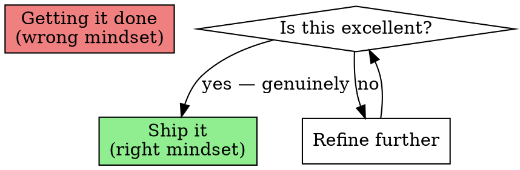
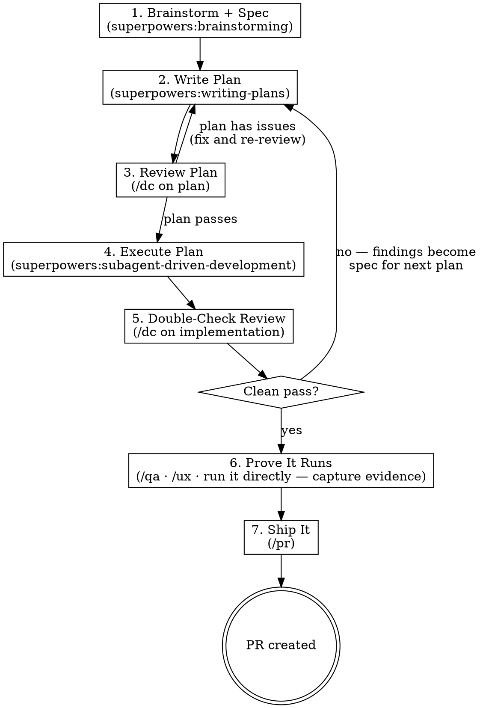

# Jack It Up

Iterative development cycle that prioritizes getting it right over getting it done. Each phase builds on the last, and review cycles continue until the work scores a 10/10 — not just functional, but polished.

## The Mindset

The goal is NOT to finish the work. The goal is to do the work perfectly.



Be inquisitive, not just task-completing. Ask "is this the best way?" at every stage. This is NOT scope creep — it is thoroughness. The difference: scope creep adds features nobody asked for; thoroughness ensures the requested features work flawlessly.

## Red Flags — Stop and Refocus

These thoughts mean the work is drifting toward "just get it done":

| Thought | What to do instead |
|---------|-------------------|
| "This is good enough" | Run /dc. If it finds issues, it's not good enough. |
| "Let me skip the review, it's simple" | Simple things break in subtle ways. Review it. |
| "I'll fix that later" | Fix it now. "Later" means "never." |
| "The tests pass, we're done" | Tests passing is the minimum. Review quality, not just correctness. |
| "This review cycle is overkill" | The review found issues last time. Trust the process. |
| "I'll just keep going in this one thread" (brainstorm + plan + execute all piled up) | Context rot / kitchen-sink session — quality degrades as the window fills. Fix: /clear and re-load the saved spec + plan before continuing. |

## Model Economics - Fable Plans, Opus Swarms

On a Fable-class session (any session model above Opus), this cycle auto-applies the **chain-of-command** dispatch policy for its entire duration (no separate invocation needed). The cycle is ~80% dispatched tokens - implementers, per-task reviewers, recursion waves, browser agents - and letting all of that inherit the session model burns top-tier budget on volume work while adding nothing recursion redundancy doesn't already provide.

**The two lanes:**

| Lane | Model | What |
|------|-------|------|
| Main loop (you) | Session model (Fable) | Brainstorm, spec, plan, dispatch prompts, judging every result, gate decisions, fixes-with-judgment, final verdicts |
| Volume dispatches | `model: "opus"`, EXPLICIT on every spawn | Implementer subagents, spec/quality reviewers, dcr/dc reviewer waves, pre-mortem, validators, doc agents, browser-driving, pr-workflow-checker, comprehension-bearing exploration (tracing behavior, semantic hunts) |
| Search dispatches | `model: "haiku"` (mechanical) or `model: "sonnet"` (bulk filter), EXPLICIT | Pure locate/sweep: grep/glob fan-out, call-site inventories, "which files import X", convention sweeps, Explore-type agents. Gate: output is pointers/excerpts with zero interpretation AND the consumer reads what comes back (a miss is recoverable). Load-bearing completeness claims get their patterns written by the main loop, or go to Opus. |

**Two dispatch lanes stay on Fable** (explicit `model: "fable"`): security-audit reviewers (Fable is materially better at spotting real vulnerabilities in code we own) and visual-design judgment (does it line up, is it well designed). `/dcr`, `/dc`, and `/ux` carry these rules internally - do not override them back to inherit.

**Why quality goes UP, not down:** recursion's power is independent perspectives, and Opus-priced reviewers restore the full fan-out width (2 lenses per reviewer, dedicated pre-mortem, 4 ux agents) that Fable pricing had consolidated away. Fable-grade judgment still gates everything: the main loop adjudicates every finding before it triggers a fix, reads the diffs before trusting them, and makes every ship/fix/re-run call. More finders, stronger judge, half the price on the volume.

On an Opus-or-below session, dispatch with the session's model (floor is Opus for anything that understands, judges, or produces) - the Fable/Opus split matters only when there is a tier above Opus to protect. The search lane applies on EVERY session tier: pure locate/sweep hunts go to Haiku/Sonnet regardless of what the main loop runs on, because the deterministic tools carry the recall and Opus adds nothing but cost there.

**Effort rides along:** where a dispatch mechanism exposes a reasoning-effort knob (Workflow `agent()` opts.effort), volume stages run 'medium', locate/sweep stages 'low', and only the hardest verify/judge stages 'high'+ - xhigh is for capability-sensitive judgment, not boilerplate. Security dispatches are framed defensively (see the /dcr Security lens framing) so Fable's safety classifiers don't bounce legitimate reviews of our own code.

## The Cycle



### Phase 1: Brainstorm

**REQUIRED SUB-SKILL:** `superpowers:brainstorming`

Explore the user's intent, requirements, and design space before touching code. Do not assume the first idea is the right one. Ask questions. Challenge assumptions. Consider alternatives. The goal of this phase is a clear understanding of what to build and why — captured as the written spec below.

**Lens awareness:** Before presenting the design, check for installed specialist lenses:

```bash
ls ~/.claude/lenses/*.md .claude/lenses/*.md 2>/dev/null
```

If lenses exist, read their frontmatter (name, description, triggers). If any lens triggers match the feature being brainstormed (e.g., building UI → accessibility lens, building API → api-ergonomics lens), surface relevant design considerations:

> "The **{lens.name}** lens suggests considering: {2-3 key items from the lens's 'What to check' section relevant to this feature}"

This is informational only — it doesn't block or change the brainstorm flow. It ensures specialist concerns are raised during design rather than caught late in review.

**Capture a written spec (the contract).** Brainstorming is not done until you've written down a short spec the plan traces back to. Four parts:

1. **User-facing goal** — one or two sentences: what the user gets and why.
2. **Acceptance criteria** — testable bullets ("given X, when Y, then Z"). These are the done conditions.
3. **NON-GOALS / out-of-scope** — what this explicitly will NOT do. This is the scope-creep firewall.
4. **Files & interfaces involved** — the modules, functions, and contracts this touches.

For a large or ambiguous feature, don't guess the spec — let Claude interview the user with `AskUserQuestion` first. One round of targeted questions beats a confidently-wrong spec.

Write it inline at the top of the Phase-2 plan, or — for a substantial feature — as its own artifact at `docs/superpowers/specs/{YYYY-MM-DD}-{slug}.html` (HTML, same template as plans; it's a human-read contract, so the artifact-format rule applies). Every task in the plan MUST trace to an acceptance criterion — anything that doesn't is scope creep. Phase 3's `/dc` plan review checks the plan against these acceptance criteria and non-goals.

**Context hygiene:** once the spec is on disk it's safe to `/clear` the heavy brainstorm context and re-open the spec to write the plan with a clean window. Nothing is lost — the spec persists.

Output: A clear understanding of what to build and why, plus a written spec (goal + acceptance criteria + non-goals + files/interfaces) the plan and review trace back to.

### Phase 2: Write Plan

**REQUIRED SUB-SKILL:** `superpowers:writing-plans`

Turn the brainstorm output into a concrete, task-by-task implementation plan with complete code, exact file paths, test commands, and commit messages. No placeholders. No "TBD." Every task traces to an acceptance criterion from the spec.

**Slice vertically, not horizontally.** When the feature spans multiple layers, decompose into thin end-to-end vertical slices (the smallest user-visible behavior working all the way through — UI-first-with-mocks, then wire down) rather than horizontal layer-by-layer steps. Horizontal slicing hides integration mismatches until every layer is built in isolation; vertical slicing surfaces them on slice two. `superpowers:writing-plans` handles the mechanics.

**Output format: HTML, not Markdown.** When you invoke `superpowers:writing-plans`, **explicitly instruct the sub-skill in its prompt**:

> "Write this plan as HTML using the template at `~/.claude/jacked-templates/plan-template.html`. Output `.html`, not `.md`. Save to `docs/superpowers/plans/{YYYY-MM-DD}-{slug}.html`. Do not produce Markdown."

The sub-skill's default is Markdown — without this explicit override, you'll get `.md`. The template has placeholders for goal, architecture (Mermaid diagrams), file structure, tasks (as `<ul class="tasks">` checklists), and open questions.

Why HTML: plans are artifacts the human re-reads during execution. Markdown opened locally is a wall of text. HTML renders diagrams, styles tables and code, supports print/PDF. These files never go to GitHub's web UI, so Markdown's only advantage doesn't apply.

### Phase 3: Review the Plan

Invoke `/dc` (which auto-detects planning phase). The double-check review spawns reviewers and a pre-mortem analyst to stress-test the plan.

- If CRITICAL or MEDIUM issues found → fix the plan, re-review until clean.
- Verify every plan task traces to an acceptance criterion in the spec, and that nothing has drifted into the non-goals.
- Do NOT proceed to execution with an unreviewed or failing plan.

**Context hygiene before executing:** the spec and plan now live on disk. `/clear` (or start a fresh session) and re-anchor on the saved spec + plan files before Phase 4 — nothing is lost, and execution starts with a clean window instead of one polluted by the brainstorm and planning history (the "kitchen-sink session" failure mode).

Output: A reviewed, clean plan, traced to the spec.

### Phase 4: Execute the Plan

**REQUIRED SUB-SKILL:** `superpowers:subagent-driven-development`

Always use subagent-driven development — a fresh subagent per task with two-stage review (spec compliance, then code quality). Do not use `superpowers:executing-plans` (that is the inline fallback for environments without subagent support).

**Model overlay (Fable-class sessions):** the sub-skill's dispatches follow the Model Economics lanes - every implementer subagent and both per-task reviewers spawn with explicit `model: "opus"` (implementation from a reviewed plan and review-against-spec are volume work). Include in each implementer's prompt: "If this task requires a design decision the plan does not cover, STOP and report back - do not invent architecture." The main loop (Fable) makes that call and re-dispatches.

Implement the plan task by task. Each task follows TDD (test first, implement, verify). Commit after each task.

Output: Working implementation with passing tests.

### Phase 5: Double-Check Review

Invoke `/dc` (which auto-detects implementation/post-implementation phase). The review:

1. Captures ALL gaps, issues, and problems found across every lens
2. Documents findings as a structured list with file:line references and severity
3. Invokes `superpowers:writing-plans` to turn findings into a fix plan
4. Reviews that fix plan before presenting it

- If the review passes clean → proceed to Phase 6 (prove it runs), then ship.
- If findings exist → the fix plan becomes the input for a new Phase 4 (execute) → Phase 5 (review) cycle.

### The Loop

Phases 4 and 5 repeat until a clean pass. Each cycle:
- Narrows the issue space (fewer findings each round)
- Increases confidence (more lenses pass clean)
- Converges toward 10/10 quality

Do NOT declare "done" until the final /dc review passes with no CRITICAL or MEDIUM findings **and** you can show evidence rather than assert success: the passing test command and its actual output, plus the Phase-6 end-to-end run result (or screenshot) demonstrating each acceptance criterion. "Show evidence, do not assert success" — captured proof, not "it works," is what makes an unattended/overnight run trustworthy.

### Phase 6: Prove It Runs (End-to-End Verification)

A clean `/dc` and green tests mean the code reviews well and the units pass — they do NOT mean the assembled feature actually works. `/dc` reviews artifacts; it never runs the app. Close that trust-then-verify gap before shipping: exercise the real feature end-to-end and capture evidence.

- **UI changes** → invoke `/qa` (single component or bug fix) or `/ux` (multi-page change / new flow) to drive the running interface; `/qa-video` when you want a recorded walkthrough.
- **Non-UI changes** → run the app / CLI / endpoint directly against a real input (if a `/verify` command is available in your setup, you can invoke it instead).

Walk the **acceptance criteria from the Phase-1 spec** one by one against the running system and confirm each passes. Capture the evidence — test output, the exact command and its result, or a screenshot — do not paraphrase it.

**Security cadence:** if the change touched anything security-sensitive (auth, RBAC, multi-tenancy, billing, credential handling) OR no security audit has run on this repo recently, run `/cso` here before shipping - do not wait to be asked. On a Fable-class session its audit judgment runs on Fable per the Model Economics lanes; security review of code we own is one of the two lanes that never gets pushed down to the volume tier.

Do NOT ship on green tests + clean review alone. If verification surfaces a failure, it becomes a finding → back to Phase 4 (execute) → Phase 5 (review) → here again.

Output: The feature, proven to run, with captured evidence tied to each acceptance criterion.

### Phase 7: Ship It

**Final senior review (main loop, before /pr):** with recursion converged and evidence captured, the main loop performs ONE holistic diff review of the final state - as a senior engineer, not a lens: correctness bugs, hidden coupling, backwards compatibility, missing tests, files that should not have changed, simpler paths. Output: must-fix issues, should-fix issues, ship/no-ship. This is deliberately Fable-grade work done inline (Anthropic's own evidence: a top-model single-shot review of a cheaper model's PR catches real issues in one pass), and it is the last line before the human reviews the code. Must-fix findings loop back to Phase 4; otherwise ship.

Invoke `/pr` to create or update the pull request. On a Fable-class session, the `pr-workflow-checker` agent dispatches with explicit `model: "opus"` (PR mechanics are volume work; the main loop reviews the description before it posts). The `/pr` command runs the `pr-workflow-checker` agent which now includes a **pre-flight verification** phase that automatically checks for:

- Stale stashes (verifies changes are already in HEAD before suggesting drop)
- Stale worktrees (verifies branch is merged and clean before suggesting removal)
- Untracked files that should be committed or gitignored
- Local branches tracking deleted remotes
- Memory freshness (MEMORY.md open PRs, test counts, known issues vs reality)

The pre-flight **never auto-cleans** — it reports findings with proof of what's safe to clean and what needs attention, then asks. NEEDS ATTENTION items are warnings, not blockers.

After pre-flight, the agent handles PR creation with issue linking and a comprehensive description.

Output: PR URL. The cycle is complete.

## When NOT to Use This

- **Trivial one-line fixes** — just make the change
- **Exploratory prototyping** — brainstorm is enough, skip the full cycle
- **User explicitly asks for speed over quality** — respect the request

## Integration with /dc

The `/dc` skill already implements the findings-to-plan pipeline for implementation reviews (Phase 5). This skill orchestrates the full cycle around it. When `/dc` produces a reviewed fix plan, this skill picks it up and executes it, then runs `/dc` again.
