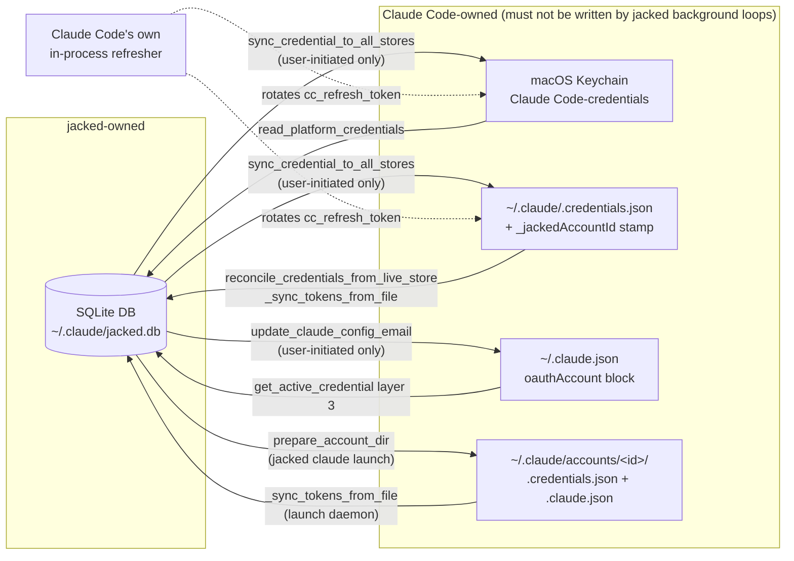
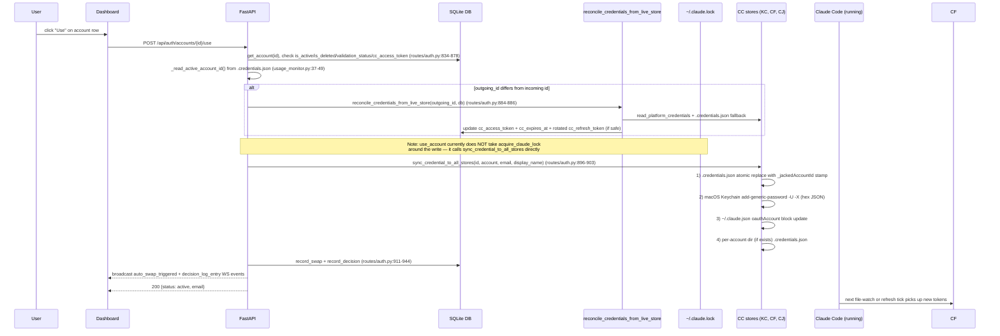

# OAuth and Credential Lifecycle — Canonical Architecture

**Last updated:** 2026-04-16
**Status:** Canonical reference. Every claim is cited file:line against the current tree. When prior docs disagree with the code, the code wins (disagreements are flagged inline).

---

## 1. Overview

jacked manages multiple Claude Code accounts behind a single on-disk credential surface that Claude Code itself owns. Two independent OAuth token pairs live on each account row: a **primary pair** (`access_token` / `refresh_token` / `expires_at`) which jacked uses for its own upstream calls (profile, usage, optional long-lived API key) and a **CC pair** (`cc_access_token` / `cc_refresh_token` / `cc_expires_at`) which Claude Code consumes via the shared credential stores. The primary pair is obtained during the "primary" OAuth flow, which typically immediately mints a long-lived API key, overriding the short-lived OAuth tokens with a ~1-year API key (`jacked/web/oauth.py:411-444`). The CC pair is obtained via a separately-initiated OAuth flow with `purpose="claude_code"` (`jacked/web/oauth.py:336-354`, `jacked/api/routes/auth.py:791-812`) and must never be rotated by jacked's background loops on the active account — doing so consumes the single-use refresh token that Claude Code's own session depends on.

The credentials are mirrored across five stores: (A) the jacked SQLite DB at `~/.claude/jacked.db` (the Account row; `jacked/web/database.py:38-74`), (B) the macOS Keychain entry `Claude Code-credentials` under the system username (`jacked/api/credential_helpers.py:97-112`, `437-486`), (C) the global credentials file at `~/.claude/.credentials.json` (`jacked/api/credential_helpers.py:585-603`), (D) the identity block in `~/.claude.json` under `oauthAccount` (`jacked/api/credential_helpers.py:162-229`), and (E) per-account isolation dirs at `~/.claude/accounts/<account_id>/` (`jacked/api/credential_helpers.py:624-651`, `jacked/launch.py:397-470`). The core safety invariant — established in `docs/superpowers/specs/2026-03-24-kill-background-credential-writes-design.md` and still holding in the current code — is that **jacked's background loops must never write to Claude Code's credential stores (B, C, D, E); they only persist to the DB (A)**. User-initiated actions (OAuth add/re-auth, dashboard "Use Account", `jacked claude <id>` launch, and in-band 429 recovery for the active account) are the only paths that touch CC-owned stores, and they do so under the cross-process `~/.claude.lock` mkdir lock (`jacked/api/credential_helpers.py:31-89`).

**The exception we must flag up front:** the periodic token refresh loop (`jacked/api/main.py:52-68`) calls `refresh_all_expiring_tokens` (`jacked/web/auth.py:1002-1080`) which in turn calls `refresh_cc_token` for *every* account whose CC token is nearing expiry — including the active one. `refresh_cc_token` does NOT write to CC credential stores (correctly, per the invariant), but exchanging the CC refresh token at Anthropic's OAuth endpoint rotates it upstream. Since jacked writes the new refresh token only to the DB (not Keychain), Claude Code's next refresh attempt with the stale Keychain value fails with `invalid_grant`. See §7 for the exact mechanism and §8 for the affected invariant.

---

## 2. Token Model

The primary and CC token pairs live side-by-side on a single Account row. The following table enumerates every token-bearing column and its ownership (`jacked/web/database.py:201-235`, `jacked/web/database.py:38-74`).

| Field | Purpose | Who writes to DB | Who writes to Keychain / `.credentials.json` | Rotated by |
| --- | --- | --- | --- | --- |
| `access_token` | Primary token jacked uses for profile/usage/API-key-minting calls. Usually a long-lived API key after `_create_api_key` runs (`jacked/web/oauth.py:427-435`). | OAuth `_complete_auth` (`jacked/web/oauth.py:303-359`), `_refresh_token_flow` PRIMARY/PRIMARY_CIRCUIT_BREAKER success (`jacked/web/auth.py:285-292`), `_refresh_token_flow` CC_OR_PRIMARY_429 when `used_cc=False` (`jacked/web/auth.py:310-317`), `_sync_tokens_from_file` pre-migration fallback (`jacked/launch.py:781-800`). | **Never** written to CC stores by jacked. `build_oauth_data` fallback path exposes `access_token` as `accessToken` but forces `refreshToken: null` (`jacked/api/credential_helpers.py:539-550`). | Manual refresh endpoint (`jacked/api/routes/auth.py:543-571`), token refresh loop (`jacked/api/main.py:52-68`), heal loop (`jacked/api/main.py:71-80`), 401 auto-refresh on usage/profile (`jacked/web/auth.py:722-732`, `815-858`), pre-launch (`jacked/launch.py:356-362`). |
| `refresh_token` | Primary OAuth refresh token. NULL for API-key accounts (`jacked/web/oauth.py:433`). | Same as `access_token`. | **Never** written to CC stores — `build_oauth_data` forces `null` even in the primary fallback path to prevent Claude Code from consuming jacked's refresh token (`jacked/api/credential_helpers.py:539-550`, rule enforced by `build_oauth_data` docstring examples at lines 502-505). | Anthropic's OAuth server on every successful refresh via `_exchange_refresh_token` (`jacked/web/auth.py:108-160`). Persisted to DB by `_refresh_token_flow` success path. |
| `expires_at` | Epoch seconds when `access_token` expires. | OAuth `_complete_auth` (`jacked/web/oauth.py:501`, `566-567`), `_refresh_token_flow` PRIMARY success (`jacked/web/auth.py:283-292`), `_sync_tokens_from_file` (`jacked/launch.py:793-794`). | Not written to CC stores as a discrete field — encoded into `claudeAiOauth.expiresAt` ms via `build_oauth_data` (`jacked/api/credential_helpers.py:545`). | Same as `refresh_token`. |
| `cc_access_token` | Short-lived Claude Code access token. Written into `claudeAiOauth.accessToken` of `.credentials.json` / Keychain when this account is active. | OAuth `_complete_auth` with `purpose="claude_code"` (`jacked/web/oauth.py:626-689`), `_refresh_token_flow` CC success (`jacked/web/auth.py:293-300`), `_refresh_token_flow` CC_OR_PRIMARY_429 when `used_cc=True` (`jacked/web/auth.py:301-309`), `_refresh_token_flow` invalid_grant access-token-only recovery (`jacked/web/auth.py:410-421`), `reconcile_credentials_from_live_store` (`jacked/api/credential_helpers.py:385-386`), `_sync_tokens_from_file` with CAS (`jacked/launch.py:704-770`), one-time seeding migration (`jacked/web/database.py:566-573`). | Written via `sync_credential_to_all_stores` (`jacked/api/credential_helpers.py:583`) only in user-initiated paths: OAuth completion (`jacked/web/oauth.py:331-333`), `use_account` endpoint (`jacked/api/routes/auth.py:898-903`), auto-swap `_execute_swap` (`jacked/api/usage_monitor.py:248-254`), `prepare_account_dir` (`jacked/launch.py:439`, `463-468`), `_refresh_token_flow` CC_OR_PRIMARY_429 only when account is active AND live credentials prove ownership (`jacked/web/auth.py:344-365`). | `refresh_cc_token` (`jacked/web/auth.py:572-587`), auto-swap 429 retry (`jacked/web/auth.py:765-776`). **BUG:** see §7 — active-account CC refresh by the 30min loop rotates Anthropic-side but does not re-sync the Keychain. |
| `cc_refresh_token` | Single-use refresh token for the CC access token. **SHARED WITH CLAUDE CODE** on the active account — Claude Code's in-process refresher also consumes it. | OAuth `_complete_auth` with `purpose="claude_code"` (`jacked/web/oauth.py:676`), `_refresh_token_flow` CC / CC_OR_PRIMARY_429 success (`jacked/web/auth.py:296`, `305`), cleared to NULL on `invalid_grant` with no recovery (`jacked/web/auth.py:425-431`), `reconcile_credentials_from_live_store` rotation/recovery import (`jacked/api/credential_helpers.py:411`, `418`) — blocked when `refresh_failure_type == "invalid_grant"` (`jacked/api/credential_helpers.py:394-404`), `_sync_tokens_from_file` CAS (`jacked/launch.py:742-770`). | Written via `sync_credential_to_all_stores` as `claudeAiOauth.refreshToken` in the CC-present branch of `build_oauth_data` (`jacked/api/credential_helpers.py:524-537`). Written only on user-initiated paths (same as `cc_access_token`). | `refresh_cc_token` / `_refresh_token_flow` CC mode (`jacked/web/auth.py:572-587`), 429 recovery CC_OR_PRIMARY_429 mode (`jacked/web/auth.py:626-631`), Claude Code's own refresher (external process) — which is why jacked must avoid rotating this for the active account. |
| `cc_expires_at` | Epoch seconds when `cc_access_token` expires. | OAuth `_complete_auth` (`jacked/web/oauth.py:670-677`), `_refresh_token_flow` CC success (`jacked/web/auth.py:297`), `_refresh_token_flow` invalid_grant recovery (`jacked/web/auth.py:411-412`), `reconcile_credentials_from_live_store` (`jacked/api/credential_helpers.py:388-392`), `_sync_tokens_from_file` (`jacked/launch.py:734-736`). | Encoded into `claudeAiOauth.expiresAt` in ms (`jacked/api/credential_helpers.py:532`). | Same as `cc_access_token`. |
| `validation_status` | `"valid"` / `"invalid"` / `"unknown"` / `"checking"`. Drives dashboard badges and heal-loop selection. | OAuth success (`jacked/web/oauth.py:576-578`, `600-604`, `678-680`), `validate_account` (`jacked/web/auth.py:899-956`), `refresh_account_token` on second consecutive 401/403 (`jacked/web/auth.py:606-616`), `fetch_usage` 401 after refresh+live-import both fail (`jacked/web/auth.py:752-758`), heal loop success (`jacked/web/auth.py:1146-1150`), `_sync_tokens_from_file` on sync (`jacked/launch.py:746-749`, `783-784`), auto-swap filters on `!= "invalid"` (`jacked/api/usage_monitor.py:136-137`). | N/A — DB only. | Same writers as above. |
| `refresh_failure_type` | String classification of last refresh failure: `"invalid_grant"`, `"http_401"`, `"http_403"`, `"http_429"`, `"http_5xx"`, `"network_error"`, or `http_<code>` variants. Drives circuit breaker cooldown and the invalid_grant gate in `reconcile_credentials_from_live_store`. | `_refresh_token_flow` on any error (`jacked/web/auth.py:426-470`), `_refresh_token_flow` success clears it to NULL (`jacked/web/auth.py:288-316`), heal loop clears it before retry (`jacked/web/auth.py:1120-1124`). | N/A — DB only. | Same. |
| `refresh_last_failed_at` | Epoch seconds of last refresh failure. Combined with `refresh_failure_type` this is the circuit breaker state. | Same as `refresh_failure_type`. | N/A — DB only. | Same. |

**Cooldown table for circuit breaker** (`jacked/web/auth.py:99-105`): `invalid_grant` 600s, `network_error` 60s, `http_429` 120s, `http_5xx` 120s, default 300s. Enforced in `_refresh_token_flow` step 4c (`jacked/web/auth.py:232-248`) — but only for `RefreshMode.PRIMARY_CIRCUIT_BREAKER`.

> **Callout — prior docs vs current code (circuit breaker):** the older `docs/superpowers/specs/2026-04-06-token-resilience-and-ui-fixes-design.md` describes the circuit breaker as active for `PRIMARY_CIRCUIT_BREAKER` only; the current code matches. However, that same spec says `refresh_account_token` should "record error + set circuit breaker cooldown" on first 401/403 and "mark invalid" on the second. The current code (`jacked/web/auth.py:605-616`) only sets `validation_status=invalid` on the second consecutive auth failure — the first failure sets only the circuit breaker via `_refresh_token_flow` step 4k (`jacked/web/auth.py:459-471`). This matches the spec's intent.

---

## 3. The Five Stores

jacked maintains one authoritative source (DB) plus four mirrors that are Claude Code's property. Each mirror is updated only from user-initiated paths or, for the per-account dir, by `launch.py` wrappers.

### A. SQLite DB (`~/.claude/jacked.db`) — Account row

**Schema:** `jacked/web/database.py:201-235`, with migrations for `cached_usage_raw`, `cc_access_token`/`cc_refresh_token`/`cc_expires_at`, `organization_uuid`/`organization_name` (table recreate at `jacked/web/database.py:578-642`), `auto_swap_enabled` (`jacked/web/database.py:643-652`), and `refresh_last_failed_at`/`refresh_failure_type` (`jacked/web/database.py:653-669`).

**Pydantic model:** `Account` at `jacked/web/database.py:38-87` includes all token columns plus computed `is_default` / `is_expired`.

**Reads:** every hot path — `refresh_account_token` / `refresh_cc_token` / `_refresh_token_flow` read then re-read under lock (`jacked/web/auth.py:178-229`), `fetch_usage` (`jacked/web/auth.py:661`), `_account_to_response` (`jacked/api/routes/auth.py:285-348`), auto-swap poll (`jacked/api/usage_monitor.py:407-412`), `prepare_account_dir` (`jacked/launch.py:364-378`).

**Writes:** routed through `Database.update_account` (`jacked/web/database.py:945-971`), guarded by `_ACCOUNT_UPDATE_COLS` whitelist (`jacked/web/database.py:911-943`). The whitelist excludes `display_name` (use `set_account_label`) and excludes `email` entirely (email is set on row creation only). Threaded `_writer` context manager acquires `self._write_lock` (`jacked/web/database.py:441-450`).

**Invariant:** DB is the only store background loops can write. Every other store is CC-owned and must not be touched by background code.

### B. macOS Keychain entry `"Claude Code-credentials"`

**Identifier:** service `"Claude Code-credentials"`, account = `$USER` (falling back to `$USERNAME` then the literal string `"Claude Code"`) (`jacked/api/credential_helpers.py:97-112`). The fallback is critical: Claude Code uses `process.env.USER || userInfo().username`, so a mismatched username writes to a different Keychain entry.

**Format:** JSON blob, hex-encoded via `security add-generic-password -X` (`jacked/api/credential_helpers.py:449-462`). Shape:
```json
{"claudeAiOauth": { "accessToken": "...", "refreshToken": "...", "expiresAt": <ms>, ... }, "_jackedAccountId": <int>}
```
The hex encoding matches Claude Code's on-disk format and keeps the JSON out of process args (CrowdStrike / process-monitor exposure mitigation, per the `-X` comment at `credential_helpers.py:454`).

**Reads:** `read_platform_credentials` (`jacked/api/credential_helpers.py:237-264`) via `security find-generic-password ... -w`; 5s timeout. Callers: `read_fresh_active_token` (`jacked/api/credential_helpers.py:267-296`), `reconcile_credentials_from_live_store` (`jacked/api/credential_helpers.py:344-358`), `_refresh_token_flow` CC_OR_PRIMARY_429 active-account gate (`jacked/web/auth.py:351-352`), OAuth invalid_grant recovery gate (`jacked/web/auth.py:391-401`), `get_active_credential` layer-1/2 fallback (`jacked/api/routes/auth.py:1014-1018`), `resolve_account` layers 3/4 (`jacked/launch.py:510-541`).

**Writes:** `write_platform_credentials` (`jacked/api/credential_helpers.py:432-486`) — no-op on non-macOS. Called only from `sync_credential_to_all_stores` step 2 (`jacked/api/credential_helpers.py:605-610`), which in turn runs on:
1. OAuth completion (`jacked/web/oauth.py:331-333`)
2. `use_account` endpoint (`jacked/api/routes/auth.py:898-903`)
3. `_execute_swap` (`jacked/api/usage_monitor.py:246-254`)
4. `_refresh_token_flow` CC_OR_PRIMARY_429 active-account 429 recovery (`jacked/web/auth.py:344-365`)
5. `prepare_account_dir` writes Keychain directly via `write_platform_credentials(existing)` (`jacked/launch.py:463-468`)

Also cleans up an orphan `-a "Claude Code"` entry from old jacked versions after a successful write (`jacked/api/credential_helpers.py:472-482`).

### C. `~/.claude/.credentials.json`

**Shape:**
```json
{"claudeAiOauth": {...}, "_jackedAccountId": <int>}
```

Same payload as Keychain. The `_jackedAccountId` stamp is the primary ground truth for "which jacked account is currently active" (`jacked/api/credential_helpers.py:599`). Per-account files at `accounts/<id>/.credentials.json` intentionally do *not* stamp — the account ID is implicit from the directory name (`jacked/api/credential_helpers.py:639-642`).

**Reads:** `_read_active_account_id` (`jacked/api/usage_monitor.py:37-49`), `_get_active_account_id_cached` in routes (`jacked/api/routes/auth.py:266-282`), `read_fresh_active_token` fallback (`jacked/api/credential_helpers.py:285-296`), `reconcile_credentials_from_live_store` fallback (`jacked/api/credential_helpers.py:350-356`), `_refresh_token_flow` invalid_grant recovery fallback (`jacked/web/auth.py:394-399`), `refresh_all_expiring_tokens` active-account lookup (`jacked/web/auth.py:1034-1042`), `get_active_credential` layer 1 (`jacked/api/routes/auth.py:1005-1012`), `resolve_account` layer 1 (`jacked/launch.py:492-498`), `refresh_all_usage` bulk endpoint (`jacked/api/routes/auth.py:655-662`).

**Writes:** `_write_credential_file` (`jacked/api/credential_helpers.py:132-159`) — atomic `tempfile.mkstemp` in the same dir then `os.replace` (retry on Windows PermissionError via `_safe_replace` at `jacked/api/credential_helpers.py:115-129`). Refuses to follow symlinks. Called from `sync_credential_to_all_stores` step 1 (`jacked/api/credential_helpers.py:585-603`) and `prepare_account_dir` (for the per-account dir variant, `jacked/launch.py:443-459`).

### D. `~/.claude.json` — `oauthAccount` block

**Shape:** a giant Claude Code config file. jacked only touches `oauthAccount`:
```json
{"oauthAccount": {"emailAddress": "...", "displayName": "...", "organizationUuid": "...", "organizationName": "..."}, ...}
```

Unlike `.credentials.json`, `~/.claude.json` is NOT overwritten by Claude Code during token refresh — only during login/logout (`jacked/api/routes/auth.py:1063-1072`). That's why layer 3 of active-account detection reads it.

**Reads:** `get_active_credential` layer 3 (`jacked/api/routes/auth.py:1062-1103`) falls back to email+org matching when `.credentials.json` and Keychain fail. `_seed_oauth_account` reads it to decide whether to overwrite (`jacked/launch.py:191-278`).

**Writes:** `update_claude_config_email` (`jacked/api/credential_helpers.py:162-229`) — read-modify-write with atomic replace, preserves all other keys. Runs only as step 3 of `sync_credential_to_all_stores` (`jacked/api/credential_helpers.py:612-621`). Additionally, `_seed_oauth_account` writes a minimal `oauthAccount` block into the *per-account* `.claude.json` (`jacked/launch.py:191-278`) — this is the per-account dir variant, not the global file.

### E. `~/.claude/accounts/<id>/` — per-account isolation dirs

**Purpose:** allow `jacked claude <id>` to run a session bound to a specific account without touching global state. `CLAUDE_CONFIG_DIR=<dir>` is set in the subprocess env (`jacked/launch.py:863-864`).

**Layout** (`jacked/launch.py:344-470`):
- `.credentials.json` — per-account copy written by `prepare_account_dir` with `claudeAiOauth` payload but NO `_jackedAccountId` stamp (account ID is the directory name)
- `.claude.json` — seeded once from global config via `_seed_claude_config` (copies safe UX keys only, never identity) (`jacked/launch.py:52-111`), then overwritten by `_seed_oauth_account` to set email/org (`jacked/launch.py:191-278`), and topped up by `_seed_workspace_trust` on every launch (`jacked/launch.py:114-188`).
- `settings.json`, `CLAUDE.md`, `plugins/`, `agents/`, `commands/`, `skills/`, `projects/` — symlinked to global `~/.claude/` via `_ensure_shared_symlinks` (`jacked/launch.py:286-341`). Falls back to junctions on Windows.

**Background sync:** during `jacked claude <id>`, a daemon thread (`_token_sync_loop` at `jacked/launch.py:812-829`) polls `config_dir/.credentials.json` mtime every 30s. On change, `_sync_tokens_from_file` (`jacked/launch.py:580-809`) reads the new token, runs a strict identity check (email + org from the dir's `.claude.json` must match the DB row, `launch.py:600-686`), then writes to the DB with CAS guard against concurrent async refreshers (`launch.py:706-770`). This is read-from-file, write-to-DB — never writes back to credential files.

### Store relationship diagram



The dashed edges are Claude Code's responsibility — jacked can only *observe* them, never *cause* them.

---

## 4. Every Token Touch Point

Grouped by trigger class. File:line citations are against the current tree.

### 4.1 Foreground (user-initiated)

| # | Trigger | File:line | What it does | Active-account aware? | Writes to CC stores? | Rotates Anthropic refresh token? |
| --- | --- | --- | --- | --- | --- | --- |
| 1 | `POST /api/auth/accounts/add` — start OAuth | `jacked/api/routes/auth.py:354-372`; OAuth flow: `jacked/web/oauth.py:119-359` | Opens browser, runs PKCE, exchanges authorization code for tokens (`_exchange_code`, `oauth.py:361-409`), optionally mints API key (`oauth.py:411-444`), writes Account row, stamps `active_account_id` setting, auto-starts CC sub-flow (`oauth.py:336-354`), writes ALL credential stores via `sync_credential_to_all_stores` (`oauth.py:331-333`). | Yes — sets the account as active (`set_setting("active_account_id", ...)`). | **Yes** — this is the primary onboarding write path. | No — uses `authorization_code` grant, not `refresh_token`. |
| 2 | `POST /api/auth/accounts/{id}/reauth` — primary re-auth | `jacked/api/routes/auth.py:375-405` | Same as #1 but `target_account_id=id`. In `_store_primary_account` updates the existing row instead of creating; handles org-change redirection (`oauth.py:524-582`). Writes all stores. | Yes, explicitly targets existing account. | **Yes**. | No. |
| 3 | `POST /api/auth/accounts/{id}/authorize-cc` — CC-only flow | `jacked/api/routes/auth.py:791-812`; `jacked/web/oauth.py:491-493`, `626-688` | Starts OAuth with `purpose="claude_code"`. Skips API-key creation and `_fetch_profile` / `_fetch_usage` (`oauth.py:320-325`). Validates email + org identity match the target account (`oauth.py:641-668`). Writes to `cc_*` columns only (`oauth.py:672-688`), then `sync_credential_to_all_stores` (`oauth.py:331-333` shared code path). | Yes. | **Yes**. | No (authorization_code). |
| 4 | `POST /api/auth/accounts/{id}/use` — dashboard "Use Account" | `jacked/api/routes/auth.py:818-989` | Gates: account not deleted/disabled/invalid and has `cc_access_token`. Calls `reconcile_credentials_from_live_store` on the outgoing active account (`routes/auth.py:880-886`). Calls `sync_credential_to_all_stores(account_id, ...)` outside any lock — the sync path is what writes (`routes/auth.py:896-903`). Records `swap_log` + `decision_log` entries, broadcasts `auto_swap_triggered` and `decision_log_entry`. | Yes — becomes the new active. | **Yes** (the whole point). | No (no token exchange). |
| 5 | `POST /api/auth/accounts/{id}/refresh` — manual primary refresh | `jacked/api/routes/auth.py:543-571` | Calls `refresh_account_token(id, db)` → `_refresh_token_flow(id, db, RefreshMode.PRIMARY)`. DB-only write. | No. | No — per invariant I1. | **Yes** for primary token. |
| 6 | `POST /api/auth/accounts/{id}/refresh-usage` | `jacked/api/routes/auth.py:574-620` | Reads `read_fresh_active_token(id)` to bypass stale DB token; calls `fetch_usage(id, db, access_token=..., manual=True)` (bypasses 65s coordinator ceiling). | Only if id==active. | No. | Only via 401/429 recovery inside `fetch_usage`. |
| 7 | `POST /api/auth/accounts/refresh-all-usage` — bulk refresh | `jacked/api/routes/auth.py:623-770` | Single bulk lock (`_bulk_refresh_lock` at module level). 2s pacing between accounts. Reads active account ID once from `.credentials.json` to decide when to pass `read_fresh_active_token` result. Each call is `manual=True`. Emits `usage_refresh_started` / `usage_refresh_progress` via WS. | Per-account. | No. | Only via embedded 401/429 recovery. |
| 8 | `POST /api/auth/accounts/{id}/validate` | `jacked/api/routes/auth.py:773-788` → `validate_account` at `jacked/web/auth.py:870-972` | GET profile; on 401/403 calls `_try_refresh_primary_token` (PRIMARY_CIRCUIT_BREAKER mode) and retries; marks `valid` or `invalid`. | No. | No. | Only on 401 retry path. |
| 9 | `DELETE /api/auth/accounts/{id}` | `jacked/api/routes/auth.py:482-515` | Soft-delete (`is_deleted=1`), then `shutil.rmtree(~/.claude/accounts/<id>/)` to remove per-account dir. | No. Does NOT remove Keychain/`.credentials.json` even if this was the active account. | No (only per-account dir cleanup). | No. |
| 10 | `jacked claude <id>` CLI — `launch_claude` → `prepare_account_dir` | `jacked/launch.py:853-886`; `344-470` | Pre-launch: refresh primary + CC if near-expiry (`should_refresh` / `should_refresh_cc` gates at `launch.py:356-378`). Seeds per-account `.claude.json`, workspace trust, oauth identity, shared symlinks. Writes per-account `.credentials.json` atomically (`launch.py:443-459`). Writes global macOS Keychain too (`launch.py:463-468`). Spawns `claude` subprocess with `CLAUDE_CONFIG_DIR` set. Starts `_token_sync_loop` daemon thread that polls per-account file mtime and syncs back to DB. | Binds to a specific account. | **Yes** — writes per-account `.credentials.json` AND the global Keychain. The Keychain write is acknowledged in `docs/superpowers/specs/2026-03-24-kill-background-credential-writes-design.md` as a one-shot exception. | Only on pre-launch refresh (via `refresh_account_token` / `refresh_cc_token` PRIMARY+CC modes). |
| 11 | `jacked webux` CLI (not listed above) | — | Starts the FastAPI server — kicks off all background loops in §4.2. The server itself does not write CC stores on startup. | N/A | No | No |

### 4.2 Background loops

Every background task is created in `jacked/api/main.py:140-162`.

| # | Trigger | File:line | What it does | Active-account aware? | Writes to CC stores? | Rotates Anthropic refresh token? |
| --- | --- | --- | --- | --- | --- | --- |
| 12 | Token refresh loop (every 1800s / 30min) | `jacked/api/main.py:52-68`, `140` → `refresh_all_expiring_tokens` at `jacked/web/auth.py:1002-1080` | At the top, reads live credentials to find `active_id` and calls `reconcile_credentials_from_live_store(active_id)` once per tick (`auth.py:1030-1046`). Then iterates ALL active accounts: for each, if primary token expires within `buffer_seconds` (default 14400s/4h) calls `refresh_account_token` → `_refresh_token_flow(PRIMARY)`; additionally if `should_refresh_cc(account)` returns True calls `refresh_cc_token` → `_refresh_token_flow(CC)`. The per-account-lock check is `locked()` test on primary refresh (`auth.py:1058-1068`). The CC refresh path has NO locked() test before calling — it relies on `refresh_cc_token` to short-circuit if the lock is held (`auth.py:582-584`). DB-only writes. | **No — and this is the bug flagged in §7.** The loop calls `refresh_cc_token` for every account including the active one. | No (DB-only). | **Yes** — both primary and CC refresh exchange against Anthropic, rotating their respective refresh tokens. See §7. |
| 13 | Heal sweep (every 300s / 5min) | `jacked/api/main.py:71-80`, `144` → `heal_invalid_accounts` at `jacked/web/auth.py:1083-1167` | Selects accounts with `validation_status` in `("invalid", "unknown", "checking")`. For each: clears circuit breaker under per-account lock (`auth.py:1112-1124`), calls `refresh_account_token` (no `should_refresh` gate — healing mode always attempts), and if still not healed calls `reconcile_credentials_from_live_store` and `validate_account`. If validate succeeds, sets `validation_status="valid"`. Logs CC-re-auth-needed warning if `cc_access_token` exists but `cc_refresh_token` is NULL (`auth.py:1152-1156`). | Not specifically — it operates on the set of non-valid accounts. | No. | Yes for primary (via `refresh_account_token`). `reconcile_credentials_from_live_store` imports but does not rotate. |
| 14 | Active-account poll loop (adaptive 65-300s) | `jacked/api/main.py:145` → `active_account_poll_loop` at `jacked/api/usage_monitor.py:294-1008` | Each tick: reads settings, reads `_read_active_account_id()` from `.credentials.json` stamp, optionally primes candidate usage on first tick (`usage_monitor.py:381-398`), calls `fetch_usage` with `read_fresh_active_token` result. Computes `_compute_poll_interval` (`usage_monitor.py:82-116`) based on urgency tier + 429 override. Broadcasts `usage_poll_updated` with `_poll_interval` / `_poll_tier` / `_last_poll_at` whitelisted payload (`usage_monitor.py:431-460`). Evaluates `should_swap` and proactive-7d scheduler. On swap calls `_execute_swap` which writes all stores. Records `decision_log` + broadcasts `decision_log_entry` every tick (`usage_monitor.py:932-981`). Watchdog logs warning if tick is 2× overdue (`usage_monitor.py:998-1004`). | Yes. | **Only inside `_execute_swap`** — which is a user-intent-equivalent (auto-swap) path. The poll loop itself doesn't write CC stores outside that helper. See §8/I6. | Only via 429 recovery inside `fetch_usage`, which writes CC stores only when refreshed account IS active (`auth.py:344-365`). |
| 15 | Full sweep loop (window keeper, usage_check_interval default 300s) | `jacked/api/main.py:146` → `full_sweep_loop` at `jacked/api/usage_monitor.py:1015-1127` | Only runs when `window_keeper_enabled=true`. Only inside active hours or prewake window. For each account needing 5h or 7d ping: calls `ping_account(cc_access_token)` (Haiku, max_tokens=1) at `jacked/web/window_keeper.py:116-159`. On 401, calls `refresh_cc_token(account_id, db)` and retries ping with new token (`usage_monitor.py:1091-1098`). On ping success, calls `fetch_usage(account_id, db, access_token=cc_at)` to refresh the cached reset timestamps. 2s pacing. | Not typically — it pings inactive candidates to keep their 5h/7d windows rolling. | No — pings never write CC stores, and `refresh_cc_token` is DB-only. | **Yes** on CC refresh. Same latent bug as #12: if the pinged account happens to be the active one (the code doesn't exclude active), rotation breaks Claude Code's Keychain copy. Usually the active account is polled by loop #14, not pinged here, but there's no hard exclusion. |
| 16 | Session-accounts watcher (every 3s) | `jacked/api/main.py:141` → `session_accounts_watch_loop` at `jacked/api/watchers.py:19-112` | Uses `PRAGMA data_version` on a raw sqlite3 connection for cheap change detection. On change, queries `MAX(detected_at)` / `MAX(ended_at)` and broadcasts `sessions_changed` via WS. Force-broadcast every 20 cycles (~60s) to handle time-based session expiry. | No. | No — read-only on DB. | No. |
| 17 | Logs watcher (every 3s) | `jacked/api/main.py:142` → `logs_watch_loop` at `jacked/api/watchers.py:115-196` | Same pattern as #16 for `gatekeeper_decisions` / `hook_executions` / `version_checks`. Broadcasts `logs_changed` with `payload.tables`. | No. | No. | No. |
| 18 | Process-alive sweeper (every 60s) | `jacked/api/main.py:143` → `process_alive_sweeper_loop` at `jacked/api/watchers.py:239-310` | Checks each open session's PID with `os.kill(pid, 0)`. Ends sessions whose process is dead, heartbeats live ones. Fall-back: if session has no PID, uses global `pgrep -x claude` heuristic. Broadcasts `sessions_changed` on any change. | No. | No. | No. |
| 19 | Analytics initial scanner (once at startup) | `jacked/api/main.py:158-162` → `initial_scan_loop` at `jacked/web/analytics_monitor.py` | Parses Claude Code JSONL transcripts for cost/messages/tool-use analytics. DB-only writes to analytics tables. | No. | No. | No. |
| 20 | Analytics live monitor (polls recently-active JSONL) | `jacked/api/main.py:160-162` → `live_monitor_loop` at `jacked/web/analytics_monitor.py` | Incremental JSONL tail. DB-only. | No. | No. | No. |

### 4.3 Reactive (on-demand, in-band)

| # | Trigger | File:line | What it does | Active-account aware? | Writes to CC stores? | Rotates Anthropic refresh token? |
| --- | --- | --- | --- | --- | --- | --- |
| 21 | 401/403 on usage fetch | `jacked/web/auth.py:721-763` | `fetch_usage` retry path: (a) call `_try_refresh_primary_token` (PRIMARY_CIRCUIT_BREAKER mode, with its DB circuit breaker), (b) if refresh returns a fresh token, retry fetch with `_retry_depth=1`, (c) if refresh fails, call `reconcile_credentials_from_live_store(account_id, db)` and compare `access_token` against stale, retry if different, (d) if all fail, mark `validation_status="invalid"` with `last_error`. | Doesn't strictly check active — but live-credential import only succeeds if `_jackedAccountId` matches. | No. | Yes (primary). |
| 22 | 429 on usage fetch | `jacked/web/auth.py:765-799` | On first 429 (`_retry_depth==0`): `_try_refresh_on_429` → `_refresh_token_flow(CC_OR_PRIMARY_429)`. If that returns a token, retry fetch. On failure / subsequent 429s: escalating backoff (65s → 130s → 260s → 520s → cap 900s), track `consecutive_429s`, tier-override forces idle after 3 consecutive 429s (`usage_monitor.py:107-109`). | Active-aware only for credential-store write: `CC_OR_PRIMARY_429` writes credential stores only when `live.get("_jackedAccountId") == account_id` (`auth.py:344-365`). | **Yes — but only on the active account's 429**, and only after verifying live `_jackedAccountId` match. This is the lone in-band path that writes CC stores from what looks like a background loop. It's gated by lock acquisition. | Yes (CC first, falls back to primary when `cc_refresh_token` absent, `auth.py:189-215`). |
| 23 | 401/403 on profile fetch | `jacked/web/auth.py:850-858` | Same PRIMARY_CIRCUIT_BREAKER refresh + retry as #21, but for profile. `_refresh_depth=1` cap. | No. | No. | Yes (primary). |
| 24 | 401/403 on `validate_account` | `jacked/web/auth.py:908-928` | Same retry pattern; if retry succeeds, marks valid. | No. | No. | Yes (primary). |
| 25 | On-demand reconciliation in `_account_to_response` | `jacked/api/routes/auth.py:289-302` | For each account listed: if `row["id"] == _get_active_account_id_cached()` AND `cc_refresh_token is None` OR `cc_expires_at` has passed, calls `reconcile_credentials_from_live_store(row["id"], db)` then re-reads. | Yes — active only. | No (reconcile is DB-import only). | No. |
| 26 | 429 response during `/refresh-usage` | `jacked/api/routes/auth.py:596-600` | Returns HTTP 429 to the client if `fetch_usage` hit the coordinator `_backed_off` path. The embedded 429 recovery inside `fetch_usage` (row 22) may have already run and failed. | Depends. | Possibly (via row 22). | Possibly. |

---

## 5. Flow Diagrams

### 5.1 Adding a new account (foreground)

```mermaid
sequenceDiagram
    participant U as User (browser)
    participant D as Dashboard JS
    participant API as FastAPI jacked
    participant OA as OAuthFlow
    participant AO as Anthropic OAuth
    participant AA as Anthropic /profile, /usage, /create_api_key
    participant DB as SQLite DB
    participant CS as CC stores (KC, CF, CJ)

    U->>D: click "Add Account"
    D->>API: POST /api/auth/accounts/add
    API->>OA: OAuthFlow(db).start() (routes/auth.py:354-372)
    OA->>OA: generate_pkce + state (oauth.py:179-180)
    OA->>OA: start aiohttp callback server :45100-45199 (oauth.py:186-207)
    OA->>U: webbrowser.open(auth_url)
    Note over OA,U: 2-minute timeout on flow
    U->>AO: authorize
    AO-->>U: redirect to http://localhost:PORT/callback?code&state
    U->>OA: GET /callback (OAuthFlow._handle_callback)
    OA->>OA: CSRF state check (oauth.py:263)
    OA->>AO: POST /oauth/token grant=authorization_code (oauth.py:361-409)
    AO-->>OA: {access_token, refresh_token, expires_in, account, organization, scope}
    alt purpose == primary AND scope has org:create_api_key
        OA->>AA: POST /create_api_key (oauth.py:411-444)
        AA-->>OA: {api_key} (1-year lifetime; refresh_token set to None)
        OA->>AA: GET /profile (oauth.py:446-463)
        OA->>AA: GET /usage (oauth.py:465-482)
    end
    OA->>DB: create_account / update_account (oauth.py:496-624)
    OA->>CS: sync_credential_to_all_stores (oauth.py:331-333)
    Note over CS: writes .credentials.json + KC + ~/.claude.json + per-account dir
    OA->>DB: set_setting(active_account_id)
    OA->>OA: auto-start CC sub-flow (oauth.py:344-354)
    OA-->>API: status=completed, cc_flow_id
    D->>API: polling GET /api/auth/flow/{flow_id}
    API-->>D: status=completed
    D->>D: reload account list
```

### 5.2 Using an account ("Use Account" button)



### 5.3 Launching Claude Code with a specific account (`jacked claude <id>`)

```mermaid
sequenceDiagram
    participant CLI as jacked claude <id>
    participant DB as SQLite DB
    participant REF as refresh_account_token / refresh_cc_token
    participant PAD as prepare_account_dir
    participant PA as ~/.claude/accounts/<id>/
    participant KC as macOS Keychain
    participant CLAUDE as claude subprocess
    participant SYNC as _token_sync_loop (daemon thread)

    CLI->>DB: resolve_account(ref) (launch.py:473-577)
    Note over CLI,DB: Layer 1: .credentials.json stamp<br/>Layer 2: DB setting "active_account_id"<br/>Layer 3: Keychain stamp<br/>Layer 4: Keychain token match
    CLI->>PAD: prepare_account_dir(account, db) (launch.py:344-470)
    alt should_refresh(account)
        PAD->>REF: asyncio.run(refresh_account_token(id, db)) (launch.py:356-362)
        REF->>DB: update primary access_token/refresh_token/expires_at
    end
    alt should_refresh_cc(account)
        PAD->>REF: asyncio.run(refresh_cc_token(id, db)) (launch.py:369-376)
        REF->>DB: update cc_access_token/cc_refresh_token/cc_expires_at
        Note over REF: BUG SHADOW — if id is already the active account<br/>(stamped in global .credentials.json) this rotates<br/>Anthropic's refresh token. Same mechanism as §7.
    end
    PAD->>PA: mkdir 0700, chmod 0700
    PAD->>PA: _seed_claude_config (safe UX keys only) if missing
    PAD->>PA: _seed_workspace_trust (projects with hasTrustDialogAccepted)
    PAD->>PA: _seed_oauth_account (email + org identity)
    PAD->>PA: _ensure_shared_symlinks (settings.json, plugins, agents, ...)
    PAD->>PA: write .credentials.json (atomic, no _jackedAccountId stamp)
    PAD->>KC: write_platform_credentials(existing) (launch.py:463-468)
    Note over KC: acknowledged exception to "no global writes" — one-shot,<br/>user-initiated, per kill-background-writes-design.md
    CLI->>CLAUDE: subprocess.Popen(["claude", ...], env={CLAUDE_CONFIG_DIR=PA})
    CLI->>SYNC: start daemon thread _token_sync_loop(proc, PA, db_path)
    loop every 30s while proc.poll() is None
        SYNC->>PA: stat mtime; if changed, _sync_tokens_from_file
        SYNC->>PA: read .credentials.json + .claude.json oauthAccount
        SYNC->>DB: identity check (email+org), CAS update cc_* columns
        Note over SYNC: Never writes back to files — read-only direction
    end
    CLAUDE-->>CLI: exits
    CLI->>PA: final _sync_tokens_from_file
    CLI->>DB: _close_sessions_by_pid(proc.pid) (launch.py:882-884)
    CLI->>CLI: raise SystemExit(rc)
```

### 5.4 Background token refresh loop (30min tick) — INCLUDING THE BUG

```mermaid
sequenceDiagram
    participant Loop as _token_refresh_loop
    participant RA as refresh_all_expiring_tokens
    participant REC as reconcile_credentials_from_live_store
    participant KC as Keychain (Claude Code-owned)
    participant Flow as _refresh_token_flow
    participant AO as Anthropic /oauth/token
    participant DB as SQLite DB
    participant CC as Claude Code process

    loop every 1800s
        Loop->>RA: await refresh_all_expiring_tokens(buffer_seconds=14400) (main.py:52-68)
        RA->>KC: read_platform_credentials / .credentials.json fallback (auth.py:1030-1042)
        RA->>REC: reconcile_credentials_from_live_store(active_id)
        REC->>DB: import cc_access_token / cc_expires_at / (cc_refresh_token iff refresh_failure_type != invalid_grant)
        loop for each account (INCLUDING active) in list_accounts
            alt primary expires within 4h
                RA->>Flow: refresh_account_token → RefreshMode.PRIMARY
                Flow->>AO: POST /oauth/token grant=refresh_token (primary rt)
                AO-->>Flow: new primary access_token + rotated refresh_token
                Flow->>DB: update access_token / refresh_token / expires_at / clear CB
                Note over Flow: NO credential store write (correct — invariant I1)
            end
            alt should_refresh_cc(account)
                RA->>Flow: refresh_cc_token → RefreshMode.CC
                Flow->>AO: POST /oauth/token grant=refresh_token (cc_refresh_token)
                AO-->>Flow: NEW cc_access_token + ROTATED cc_refresh_token
                Flow->>DB: update cc_access_token / cc_refresh_token / cc_expires_at / clear CB
                Note over Flow,DB: BUG: DB has new cc_refresh_token; Keychain still holds OLD one
            end
        end
    end

    rect rgba(255,0,0,0.12)
        Note over CC,KC: Later — Claude Code's own refresh ticks
        CC->>KC: read .credentials.json / Keychain
        CC->>AO: POST /oauth/token grant=refresh_token (STALE token)
        AO-->>CC: 400 {error: invalid_grant}
        CC->>CC: session re-login / logout / user sees auth prompt
    end
```

This is the "CC keeps asking to re-auth" symptom. See §7.

### 5.5 Heal loop (5min tick)

```mermaid
sequenceDiagram
    participant Loop as _heal_sweep_loop
    participant HI as heal_invalid_accounts
    participant DB as SQLite DB
    participant Lock as _get_refresh_lock(id)
    participant RA as refresh_account_token
    participant REC as reconcile_credentials_from_live_store
    participant VA as validate_account
    participant AP as Anthropic /profile

    loop every 300s
        Loop->>HI: heal_invalid_accounts()
        HI->>DB: list_accounts(include_inactive=True)
        loop for account with validation_status in (invalid, unknown, checking)
            HI->>Lock: acquire per-account async lock
            HI->>DB: clear refresh_last_failed_at + refresh_failure_type (auth.py:1120-1124)
            HI->>RA: refresh_account_token(id, db) [NO should_refresh gate — healing mode]
            RA->>Flow: _refresh_token_flow(PRIMARY)
            Flow->>Anthropic: POST /oauth/token
            alt refresh fails
                HI->>REC: reconcile_credentials_from_live_store(id, db) (auth.py:1131-1141)
                REC->>DB: import access token from live store if _jackedAccountId matches
                HI->>VA: validate_account(id, db)
                VA->>AP: GET /profile
                alt profile returns 200
                    VA->>DB: validation_status=valid, last_validated_at=now
                else profile returns 401/403 then refresh fails too
                    VA->>DB: validation_status=invalid
                end
            end
            HI->>DB: set validation_status=valid + last_validated_at on success
        end
    end
```

### 5.6 Auto-swap (usage-driven, in active_account_poll_loop)

```mermaid
sequenceDiagram
    participant P as active_account_poll_loop
    participant FU as fetch_usage
    participant BR as update_burn_rate
    participant SS as should_swap
    participant PB as pick_best_target
    participant ES as _execute_swap
    participant REC as reconcile_credentials_from_live_store
    participant Lock as acquire_claude_lock (~/.claude.lock)
    participant SYNC as sync_credential_to_all_stores
    participant DB as SQLite DB

    loop adaptive (65-300s)
        P->>P: _read_active_account_id() from credential file stamp
        P->>FU: fetch_usage(active_id, db, access_token=read_fresh_active_token(active_id))
        FU->>DB: update_account_usage_cache
        P->>P: _compute_poll_interval → _poll_tier, _poll_interval
        P->>Dashboard: WS usage_poll_updated (_poll_interval, _poll_tier, _last_poll_at)
        P->>BR: update burn rate with decay
        P->>SS: should_swap(usage_5h, usage_7d, reset timestamps, account, active_hours)
        alt want_swap OR escape_override
            P->>FU: _fetch_candidate_usage for stale non-active accounts (10min freshness)
            P->>PB: pick_best_target
            alt target found AND cooldown not active
                P->>ES: _execute_swap(db, active_id, active_acct, target, reason, trigger)
                ES->>ES: TOCTOU guard — re-read _read_active_account_id (usage_monitor.py:222-228)
                ES->>DB: record_swap (before credential write — audit survives failure)
                ES->>_last_swap_time: arm 300s cooldown
                ES->>REC: reconcile_credentials_from_live_store(outgoing)
                ES->>Lock: acquire_claude_lock (5 retries, PID stale detect)
                alt lock acquired
                    ES->>SYNC: sync_credential_to_all_stores(target_id, target)
                    SYNC->>SYNC: write .credentials.json + Keychain + ~/.claude.json + per-account dir
                else lock not acquired
                    ES->>P: credential_ok=False → reset _last_swap_time so next tick retries
                end
                ES->>invalidate_live_cred_cache(): drop 30s cache
                ES->>_burn_rates: pop both account IDs
                ES->>Dashboard: WS auto_swap_triggered
            end
        end
        alt proactive 7d path (when NOT want_swap)
            P->>P: scan ALL candidates for urgency (recoverable/hours_remaining)
            alt best_urgent found
                P->>FU: refetch best_urgent
                P->>ES: _execute_swap(trigger=proactive_7d)
            end
        end
        P->>DB: record_decision(...) + WS decision_log_entry
        P->>P: await asyncio.sleep(_poll_interval ± 15% jitter)
    end
```

### 5.7 401 / 429 recovery (reactive, in-band)

```mermaid
sequenceDiagram
    participant Caller as fetch_usage caller
    participant FU as fetch_usage
    participant AU as /api/oauth/usage
    participant TP as _try_refresh_primary_token
    participant TR as _try_refresh_on_429
    participant Flow as _refresh_token_flow
    participant REC as reconcile_credentials_from_live_store
    participant KC as Keychain / .credentials.json (live)
    participant DB as SQLite DB

    Caller->>FU: fetch_usage(account_id, db, access_token?)
    FU->>AU: GET /api/oauth/usage (Bearer token)
    alt 200
        AU-->>FU: usage data
        FU->>DB: update_account_usage_cache + clear_account_errors
    else 401/403 AND _retry_depth < 1
        FU->>TP: _try_refresh_primary_token → _refresh_token_flow(PRIMARY_CIRCUIT_BREAKER)
        alt fresh primary token obtained
            Flow->>DB: update primary access_token + clear CB
            FU->>FU: state.last_fetched_at = 0; recurse with _retry_depth=1
        else refresh failed
            FU->>REC: reconcile_credentials_from_live_store(account_id, db)
            REC->>KC: read live
            REC->>DB: import cc_access_token iff _jackedAccountId matches
            FU->>DB: re-read account; if live_token differs, recurse with live_token
            alt still failing
                FU->>DB: validation_status=invalid, last_error, last_error_at
            end
        end
    else 429 AND _retry_depth == 0
        FU->>TR: _try_refresh_on_429 → _refresh_token_flow(CC_OR_PRIMARY_429)
        alt used_cc path (cc_refresh_token present)
            Flow->>Anthropic: POST /oauth/token (cc_refresh_token)
            Anthropic-->>Flow: new cc_access_token + rotated cc_refresh_token
            Flow->>DB: update cc_* + clear CB
            alt live credentials show _jackedAccountId == account_id
                Flow->>~/.claude.lock: acquire_claude_lock (blocking retries)
                alt lock acquired
                    Flow->>KC: sync_credential_to_all_stores (active only)
                end
            end
        else fall back to primary refresh
            Flow->>Anthropic: POST /oauth/token (refresh_token)
            Flow->>DB: update primary
        end
        FU->>FU: state.consecutive_429s=0; state.last_fetched_at=0; recurse
    else 429 with no fresh token possible
        FU->>FU: escalating backoff 65→130→260→520→cap 900s; state.consecutive_429s++
        FU->>DB: record_account_error (increment_failures=False)
    end
```

---

## 6. Active-Account Detection

Three layers are used depending on caller context. Layer precedence matters because each layer has different failure modes.

### Layer 1 — `_jackedAccountId` stamp in `~/.claude/.credentials.json`

Written by `sync_credential_to_all_stores` (`jacked/api/credential_helpers.py:599`). Read by:
- `_read_active_account_id` (`jacked/api/usage_monitor.py:37-49`) — the canonical background-loop reader.
- `_get_active_account_id_cached` (`jacked/api/routes/auth.py:269-282`) — HTTP hot-path with 30s cache.
- `read_fresh_active_token` (`jacked/api/credential_helpers.py:278-296`) — Keychain first, file fallback.
- `reconcile_credentials_from_live_store` (`jacked/api/credential_helpers.py:364-365`).
- `_refresh_token_flow` CC invalid_grant recovery gate (`jacked/web/auth.py:401-421`) and CC_OR_PRIMARY_429 post-success Keychain write gate (`jacked/web/auth.py:351-365`).
- `get_active_credential` layer 1 (`jacked/api/routes/auth.py:1022-1028`).
- `resolve_account` layer 1 (`jacked/launch.py:492-498`) and layer 3 (via Keychain at `launch.py:510-516`).

Failure modes: Claude Code can delete or re-write `.credentials.json` without the stamp on re-login (the stamp is jacked-only). Keychain layer 3 is the fallback.

### Layer 2 — Token match

`get_active_credential` layers 2 (`jacked/api/routes/auth.py:1030-1060`):
1. Pass 1: `oauth_data.refreshToken` → scan `cc_refresh_token`. Refresh token is more stable than access token because it only rotates on explicit refresh.
2. Pass 2: `oauth_data.accessToken` → scan `cc_access_token`, then `access_token` (primary).

`resolve_account` layer 4 (`jacked/launch.py:523-541`) uses Keychain `accessToken` → `cc_access_token` → `access_token` ordering.

Failure modes: Claude Code refreshes tokens independently, so the file and DB will diverge after a refresh; this is why layer 1 (stamp) is preferred.

### Layer 3 — `~/.claude.json` `oauthAccount` email + organizationUuid

`get_active_credential` layer 3 (`jacked/api/routes/auth.py:1062-1103`) reads `oauthAccount.emailAddress` + `organizationUuid`:
1. Prefer `(lower(email), org_uuid)` exact match (normalizing org to `""` for personal accounts, per `routes/auth.py:1078`).
2. Fall back to email-only match.

This layer exists because on macOS Claude Code often uses the Keychain exclusively — `.credentials.json` may not exist, the Keychain may lack the `_jackedAccountId` stamp (accounts predating the dashboard-switching feature), and token-match may fail after a refresh. `~/.claude.json` is maintained by Claude Code on every platform, is touched only on login/logout (not on refresh), and always contains `emailAddress` after login.

### Which code paths honor this stack

- `get_active_credential` route (`jacked/api/routes/auth.py:992-1105`) is the only one running all three layers.
- `_read_active_account_id` (`jacked/api/usage_monitor.py`) — layer 1 only. This is the background-loop-critical reader.
- `_get_active_account_id_cached` — layer 1 only, 30s cache.
- `resolve_account` — layers 1, 2, 3, 4 (custom order).

---

## 7. Known Issues / Active Bugs

> **Update (0.41.2):** §7.1, §7.2, §7.3 are **fixed** by `read_active_account_id()` + a skip check at every CC-refresh call site, plus a shared helper to prevent layer drift. §7.4 and §7.5 remain. See commit history for the exact diffs.

### 7.1 Background CC refresh rotates the active account's refresh token

**Mechanism.** `_token_refresh_loop` fires every 1800s (`jacked/api/main.py:52-68`). It calls `refresh_all_expiring_tokens` (`jacked/web/auth.py:1002-1080`). The loop body at `jacked/web/auth.py:1048-1078` iterates over `db.list_accounts(include_inactive=False)` and, for each account, if `should_refresh_cc(account)` returns True, calls `refresh_cc_token(account_id, db)` (`auth.py:1073-1078`). There is no active-account exclusion. `refresh_cc_token` delegates to `_refresh_token_flow(..., RefreshMode.CC)` (`auth.py:572-587`).

`_refresh_token_flow` in CC mode exchanges `cc_refresh_token` against `TOKEN_URL` at `jacked/web/auth.py:277` and on success writes the rotated token only to the DB (`auth.py:293-300`) — it does NOT call `sync_credential_to_all_stores` in CC mode (`auth.py:343-365` shows that block is gated to `CC_OR_PRIMARY_429` only). This is correct per invariant I1 (no background writes to CC stores) but means **the Keychain / `.credentials.json` are not updated with the rotated refresh token**.

Claude Code's own refresher reads the Keychain (or `.credentials.json`). When Claude Code's next refresh fires — unaware that jacked rotated the token — it sends the now-stale `cc_refresh_token`. Anthropic's OAuth server returns `invalid_grant` (single-use tokens). Claude Code then either silently logs out or prompts the user to re-auth.

**Affected file:line:**
- `jacked/api/main.py:52-68` — 30min ticker.
- `jacked/web/auth.py:1002-1080` — no active skip.
- `jacked/web/auth.py:572-587` — `refresh_cc_token` → `_refresh_token_flow(CC)`.
- `jacked/web/auth.py:293-300` — DB-only write on success (no Keychain sync in CC mode).

**Symptom observed.** "CC keeps showing needs re-auth" on the active account despite sessions working. Matches the problem statement in `docs/superpowers/specs/2026-04-06-token-resilience-and-ui-fixes-design.md` §1 item 1 (but that spec addressed the stale-token-in-DB side of the symptom, not the active-account rotation issue that causes it).

**Fix direction (forward-reference).** The planned fix lives at `docs/superpowers/plans/2026-04-17-cc-refresh-active-account-skip.md` (does not yet exist — this doc forward-references it). The skip logic should live inside `refresh_all_expiring_tokens` before the `refresh_cc_token` call, reading the `_jackedAccountId` stamp (already done once at `auth.py:1030-1042` for the reconcile step) and comparing against the iterating account.

### 7.2 `launch.py` pre-launch CC refresh has the same issue

`prepare_account_dir` at `jacked/launch.py:369-376` gates CC refresh on `should_refresh_cc(account)` and calls `refresh_cc_token(account_id, db)`. If the account being launched is also the currently active account stamped in the global `.credentials.json`, this rotates Anthropic's token without updating the global Keychain. The subsequent `prepare_account_dir` writes per-account AND global Keychain at lines 443-468, so this path eventually does update the Keychain — but:
1. The window between rotation and Keychain write is exposed to any concurrent Claude Code refresh.
2. `refresh_cc_token` doesn't propagate to the per-account dir *before* it's even written.
3. If `refresh_cc_token` fails after rotation (e.g., network flap mid-exchange), the old token is dead at Anthropic but still in Keychain.

In practice `prepare_account_dir` overwrites the Keychain at lines 463-468 via `write_platform_credentials(existing)` where `existing` includes the post-refresh `build_oauth_data(account)` result — so the Keychain is repaired. But the latent race still exists.

### 7.3 Window keeper CC refresh on active account

`full_sweep_loop` at `jacked/api/usage_monitor.py:1069-1098` pings non-active accounts. On 401 it calls `refresh_cc_token`. There is no explicit active-account exclusion — the filtering happens earlier via `needs_ping` / `needs_7d_ping`. In practice the active account's 5h/7d windows are updated by loop #14 so `needs_ping` returns False; but if loop #14 fell behind, the window keeper could end up refreshing the active account's CC token with the same consequences as §7.1.

### 7.4 `use_account` does not hold the cross-process lock around credential writes

Observe `jacked/api/routes/auth.py:880-903`:
- line 884-886: reconcile outgoing (outside lock)
- line 896-903: `sync_credential_to_all_stores` (outside lock)

Compare with `_execute_swap` at `jacked/api/usage_monitor.py:246-260` which acquires `acquire_claude_lock()` around the sync. The `use_account` path lacks this guard. If Claude Code is actively refreshing its CC tokens at the exact moment the user clicks "Use Account", the two writes can race on `.credentials.json`. The atomic `os.replace` inside `_write_credential_file` means neither write is corrupted, but the file can end up with Claude Code's fresh-but-for-the-wrong-account tokens or jacked's fresh-for-the-right-account tokens depending on ordering. This has not been reported as a user-visible bug, but it is asymmetric with `_execute_swap`.

Needs verification: whether `use_account` intentionally skips the lock because CC v2.1.81+ re-reads `.credentials.json` on mtime change (claimed in the docstring at `routes/auth.py:822-825`) making the lock unnecessary. The kill-background-writes spec also suggests user-initiated writes don't need the lock because they're rare.

### 7.5 Account deletion does not revoke Keychain

`delete_account` at `jacked/api/routes/auth.py:482-515` soft-deletes the DB row and removes the per-account dir, but does nothing about the Keychain or global `.credentials.json` if the deleted account was the active one. The user is left with a Keychain entry pointing to a deleted account. The refresh token continues to work at Anthropic until it's explicitly revoked (no revoke call exists in this codebase). This isn't strictly a bug — Claude Code is welcome to use the token — but if the user deletes to "stop using", the expectation is not met.

---

## 8. Invariants

Each invariant has a 1-line rationale and enforcement file:line pointer.

- **I1.** jacked's background loops MUST NOT write to CC credential stores. *Background writes preempt Claude Code's own refresh and cause session logouts. Established in `docs/superpowers/specs/2026-03-24-kill-background-credential-writes-design.md`; enforced by `_refresh_token_flow` gating credential writes to `CC_OR_PRIMARY_429` mode only (`jacked/web/auth.py:343-365`) and `refresh_account_token` / `refresh_cc_token` never calling `sync_credential_to_all_stores`.*

- **I2.** CC refresh tokens for the active account MUST NOT be rotated by jacked. *Rotating the refresh token invalidates the copy Claude Code holds in its Keychain, breaking CC's own refresh on the next tick. Enforced as of 0.41.2 at all three call sites via `read_active_account_id()` skip checks: `jacked/web/auth.py:1082` (30-min loop), `jacked/launch.py:388` (pre-launch), `jacked/api/usage_monitor.py:1091` (window keeper 401 recovery). The shared helper at `jacked/api/credential_helpers.py:267` is the single source of truth — don't duplicate the detection logic.*

- **I3.** Primary and CC token pairs MUST NEVER share values. *They come from separate OAuth flows with different scopes and different rotation schedules. Enforced by: (a) separate DB columns (`jacked/web/database.py:201-235`), (b) `build_oauth_data` never copying `refresh_token` into `refreshToken` in the primary fallback path (`jacked/api/credential_helpers.py:539-550`), (c) migration one-time seeds `cc_access_token` from `access_token` but NEVER seeds `cc_refresh_token` (`jacked/web/database.py:566-573`).*

- **I4.** User-initiated credential writes MUST hold `acquire_claude_lock` across the read-modify-write cycle. *Prevents races with Claude Code's own file-watch refresh. Enforced by `_execute_swap` (`jacked/api/usage_monitor.py:246-260`) and `_refresh_token_flow` CC_OR_PRIMARY_429 post-success (`jacked/web/auth.py:353`). **Partially VIOLATED** by `use_account` (§7.4) and OAuth `_complete_auth` (which calls `sync_credential_to_all_stores` unlocked at `jacked/web/oauth.py:331-333`; acknowledged in the kill-background-writes spec as acceptable for the rare registration path).*

- **I5.** The primary-refresh circuit breaker is per-account. *One broken account must not block refreshes on healthy accounts. Enforced by `refresh_last_failed_at` / `refresh_failure_type` being columns on each Account row (`jacked/web/database.py:653-669`), checked per-account inside `_refresh_token_flow` step 4c (`jacked/web/auth.py:232-248`). Contrast with the pre-2026-04-06 in-memory `_primary_refresh_state` dict which had a permanent "dead" flag per process.*

- **I6.** `sync_credential_to_all_stores` must be called from a user-intent path — dashboard use_account, `_execute_swap` (auto-swap is "user set auto-swap on"), OAuth registration, `prepare_account_dir`, or CC_OR_PRIMARY_429 active-account 429 recovery (which is live-session recovery, not background maintenance). *Limits blast radius. Enforced by: all background loops calling `refresh_account_token` / `refresh_cc_token` (DB-only); only these specific call sites import `sync_credential_to_all_stores`: `jacked/api/usage_monitor.py:217`, `jacked/web/auth.py:349` (CC_OR_PRIMARY_429 path), `jacked/api/routes/auth.py:896`, `jacked/web/oauth.py:331`, and `jacked/launch.py` indirectly via `write_platform_credentials` + local atomic writes.*

- **I7.** `reconcile_credentials_from_live_store` MUST NOT import `cc_refresh_token` when `refresh_failure_type == "invalid_grant"`. *The live refresh token is Claude Code's active session token; importing+exchanging it would destroy CC's session. Enforced at `jacked/api/credential_helpers.py:394-404`, `jacked/web/auth.py:413` (invalid_grant recovery in `_refresh_token_flow` imports access token only).*

- **I8.** `_jackedAccountId` gate in `reconcile_credentials_from_live_store` is always enforced; never skipped. *Without the gate, jacked would import the wrong account's tokens after a manual credential switch outside jacked. Enforced at `jacked/api/credential_helpers.py:363-365`.*

- **I9.** `_ACCOUNT_UPDATE_COLS` whitelist is the single writable-column gate for `update_account`. *Anything not on this list (notably `display_name`, `email`, `created_at`) cannot be changed via the generic path. Enforced at `jacked/web/database.py:911-943` and `945-971`. `display_name` has a dedicated `set_account_label` (`jacked/web/database.py:973-1003`).*

- **I10.** `record_decision` returns the inserted row ID so WebSocket broadcasts can include it. *Frontend uses the ID for deduping and real-time updates. Enforced at `jacked/web/database.py:2603-2625`; callers at `jacked/api/usage_monitor.py:946-957`, `jacked/api/routes/auth.py:937-944` use the return value.*

- **I11.** Per-account dir `.credentials.json` MUST NOT include `_jackedAccountId`. *The directory name IS the account ID; stamping would create two sources of truth for an isolated session. Enforced at `jacked/api/credential_helpers.py:639-642` ("Per-account files do NOT get _jackedAccountId stamp — account_id is implicit from directory path") and `jacked/launch.py:439-440`.*

- **I12.** Token refresh PRIMARY + CC locks are disjoint. *PRIMARY and CC modes share `_refresh_locks[id]`; CC and CC_OR_PRIMARY_429 (with CC token) share `_cc_refresh_locks[id]`; CC_OR_PRIMARY_429 falling back to primary uses `_refresh_locks[id]`. Lock ordering for CC_OR_PRIMARY_429: async CC lock FIRST, then cross-process `acquire_claude_lock`. Reversing would deadlock because `acquire_claude_lock` uses blocking `time.sleep`. Enforced at `jacked/web/auth.py:202-215`, `344-365`.*

- **I13.** The CC OAuth flow validates email AND org identity against the target account row before writing. *Prevents the user from authorizing a different Google account and silently overwriting the target. Enforced at `jacked/web/oauth.py:641-668` (email lower-case comparison; org exact match or explicit reject).*

- **I14.** `_sync_tokens_from_file` (launch daemon) blocks sync when `.claude.json` `oauthAccount.emailAddress` or `organizationUuid` disagrees with the DB row. *Prevents a Claude Code re-authentication inside the per-account dir from contaminating the DB. Enforced at `jacked/launch.py:600-686`.*

---

## 9. Glossary

- **OAuth authorization code** — short-lived token returned by the Anthropic auth server at the redirect step. Exchanged once via POST `/oauth/token` grant=authorization_code. See `jacked/web/oauth.py:361-409`.

- **Access token** — Bearer token used to authenticate API calls. Short-lived (hours-days for OAuth tokens, ~1 year for minted API keys). Stored in `access_token` / `cc_access_token`.

- **Refresh token** — long-lived token that can be exchanged for a new access token via POST `/oauth/token` grant=refresh_token. Single-use — each successful exchange returns a new refresh token and invalidates the old one at the server.

- **Token rotation** — the single-use property above. When jacked exchanges `cc_refresh_token`, Anthropic hands back `access_token + new cc_refresh_token`; the old refresh token is dead. Any other process holding the old value (Claude Code's Keychain copy) will fail its next refresh with `invalid_grant`.

- **Cross-process lockfile** — `~/.claude.lock` directory created via `os.mkdir` (atomic on POSIX). Compatible with Claude Code's `proper-lockfile` protocol. Stale detection via PID file inside the lock dir. Up to 5 retries with 1-2s jittered wait. See `jacked/api/credential_helpers.py:31-89`.

- **`_jackedAccountId` stamp** — integer field jacked writes into `.credentials.json` and Keychain alongside `claudeAiOauth`. Tells jacked which Account row owns the current credentials. Absent from per-account dirs (the dir name IS the ID).

- **Primary vs CC token** — jacked maintains two token pairs per account. Primary (`access_token` / `refresh_token`) is jacked-internal and often a 1-year API key; CC (`cc_access_token` / `cc_refresh_token`) is what Claude Code consumes. They come from separate OAuth flows (primary has `purpose="primary"` and mints an API key; CC has `purpose="claude_code"` and skips API-key minting).

- **`RefreshMode` enum values** — (`jacked/web/auth.py:90-95`)
  - `PRIMARY` — caller: `refresh_account_token`. Lock: async per-account primary. Timeout: 30s. No circuit breaker gating. No credential store write. `fetch_profile` called on success.
  - `CC` — caller: `refresh_cc_token`. Lock: async per-account CC. Timeout: 30s. No CB. No credential store write.
  - `CC_OR_PRIMARY_429` — caller: `_try_refresh_on_429`. Lock: CC lock (or primary lock if falling back). Timeout: 15s. Active-account credential store write gated by `_jackedAccountId` match and `acquire_claude_lock` success.
  - `PRIMARY_CIRCUIT_BREAKER` — caller: `_try_refresh_primary_token`. Lock: async per-account primary. Timeout: 15s. **Circuit breaker enforced** (cooldown by `refresh_failure_type`).

- **`validation_status` values** — (`jacked/api/routes/auth.py:329`, default `"unknown"`)
  - `"valid"` — profile fetch or token refresh succeeded recently.
  - `"invalid"` — refresh AND live credential import both failed (fetch_usage 401 path at `auth.py:752-758`) OR refresh failed twice consecutively with 401/403 (`auth.py:606-616`) OR validate_account profile returned 401/403 after refresh retry (`auth.py:931-937`).
  - `"unknown"` — new account or recoverable errors (timeout, 429, unexpected HTTP).
  - `"checking"` — transient during `validate_account` run.
  - Heal loop selects on `("invalid", "unknown", "checking")` (`jacked/web/auth.py:1102`).

- **Circuit breaker** — two Account columns: `refresh_last_failed_at` (epoch) and `refresh_failure_type` (error classification). Cooldown by type at `jacked/web/auth.py:99-105`. Checked by `PRIMARY_CIRCUIT_BREAKER` mode only (`auth.py:232-248`). Cleared by the heal loop before retry (`auth.py:1120-1124`). Also gates `cc_refresh_token` import during reconcile when `refresh_failure_type == "invalid_grant"` (`credential_helpers.py:394-404`).

- **PKCE (Proof Key for Code Exchange)** — OAuth2 extension for public clients. Flow generates a random verifier and its SHA-256 challenge; challenge goes in the authorize URL, verifier in the token exchange. Prevents authorization-code interception. `jacked/web/oauth.py:59-74`.

- **`_jackedAccountId` vs `CLAUDE_CONFIG_DIR`** — two mechanisms for "which account is active":
  - `_jackedAccountId` stamp → global credentials → the single account Claude Code sees when launched *without* `CLAUDE_CONFIG_DIR`.
  - `CLAUDE_CONFIG_DIR=~/.claude/accounts/<id>/` → per-account credential dir → any account, chosen at launch via `jacked claude <id>`.
  The two modes coexist: running `jacked claude 3` in one terminal does not change the global stamp, so the dashboard still shows "active = N" where N is whatever was last used via the "Use Account" button or the initial OAuth add.
